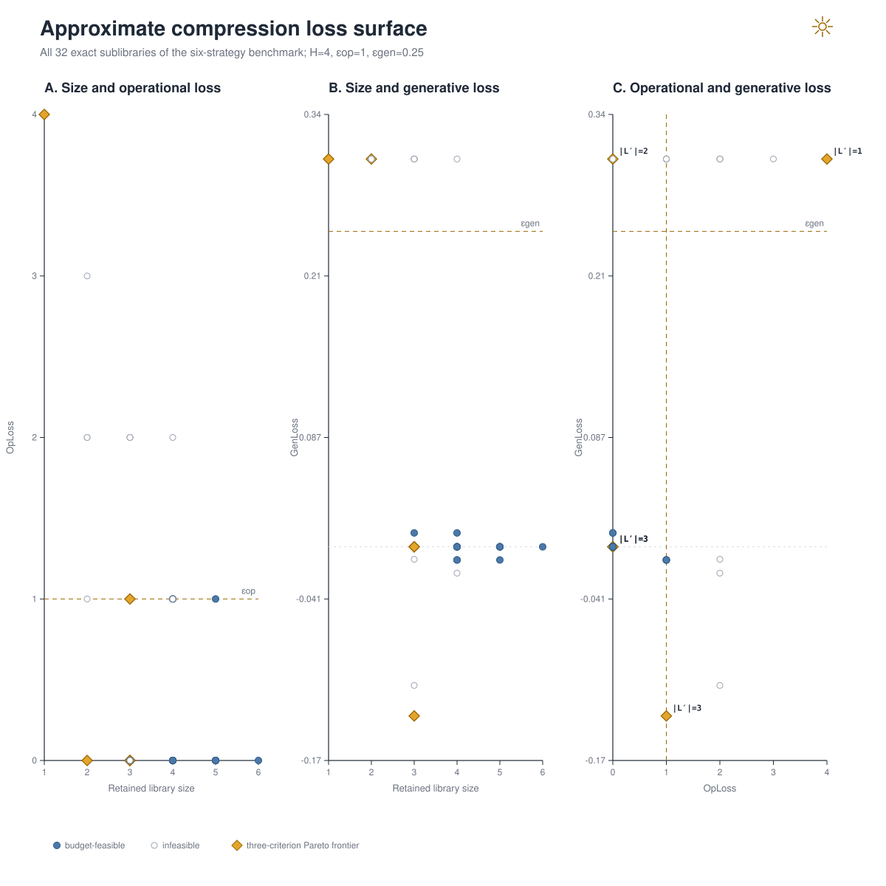
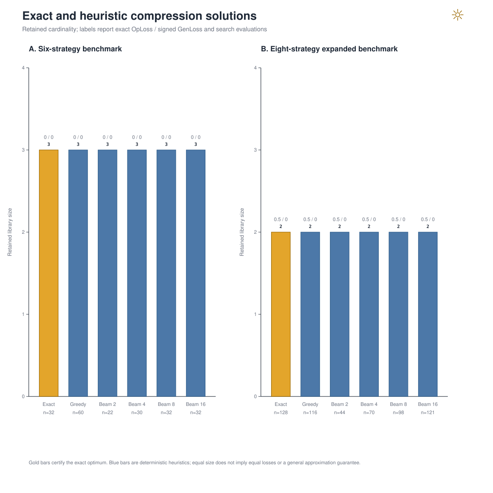

# Numerical Analysis of Approximate Library Compression

## Technical summary

Exact enumeration finds a three-strategy compression of the registered six-strategy source (50.0% reduction) with `OpLoss = 0`, `GenLoss = 0`, and `ValueLoss = 0` under $\epsilon_{op}=1$, $\epsilon_{gen}=1/4$, horizon four, and reference belief one. In the eight-strategy expanded benchmark, the exact optimum retains two strategies (75.0% reduction), with `OpLoss = 1/2`, `GenLoss = 0`, and `ValueLoss = 2025/8192` (0.2472).

All four greedy scores reach the exact minimum cardinality on both registered benchmarks. A width-16 Pareto beam also reaches the two-strategy expanded optimum after evaluating 121 of 128 subsets, but it does not certify completeness. These are benchmark results, not approximation ratios. The exact three-loss surface contains negative `GenLoss` rows: deletion can lower passive operating value while increasing the measured research-option residual.

**Evidence boundary.** This is a numerical extension only. No Lean declaration, approximation theorem, optimality theorem for a heuristic, or theorem-ledger proof status is created or changed.

## The exact surface separates operational and generative constraints

The three panels report every exact source sublibrary. Filled circles satisfy both budgets, open circles violate at least one, and diamonds are nondominated in retained size, `OpLoss`, and signed `GenLoss`. The third panel labels Pareto points by retained cardinality, avoiding a distorted three-dimensional perspective.

The six-strategy benchmark has 5 exact Pareto libraries among 32 subsets. The expanded benchmark has 11 among 128 subsets. Signed generative loss is preserved in the data rather than truncated at zero.

## Scope, data, and metric definitions

The deterministic fixture is randomized-library trial 15, reconstructed from its registered raw catalog parameters and exact seed. The base benchmark is its six-strategy source. The expanded benchmark adds both already-declared candidate strategies, giving eight strategies without changing the raw process. All payoffs, probabilities, Bellman values, losses, budgets, and dominance comparisons use `Rational{BigInt}`.

For source $L$, sublibrary $L'$, frozen-library operating value $W_H$, and unified raw-model value $V_H$:

- `OpLoss(L′) = max_b [F_L(b) − F_L′(b)]`;
- `GenLoss(L′) = [V_H(b,L) − V_H(b,L′)] − [W_H(b,L) − W_H(b,L′)]`;
- `ValueLoss(L′) = V_H(b,L) − V_H(b,L′)`.

Thus `ValueLoss = operating-value loss + GenLoss` is an exact checked identity. The optimization minimizes retained cardinality subject to the one-sided bounds `OpLoss ≤ εop` and `GenLoss ≤ εgen`. Because the stated generative definition is signed, negative values are feasible and economically mean that the research-option residual rises after compression.

## Exact, greedy, Pareto, and integer-program methods

Small libraries use complete bit-mask enumeration over every sublibrary containing the inactive strategy, deterministic cardinality-first tie-breaking, and exact Pareto dominance in `(size, OpLoss, GenLoss)`. This is the only method that receives an optimality certificate.

Larger-library support has four backward-deletion scores—balanced budget use, operational loss first, generative loss first, and total value loss first—plus a deterministic multistart selector. The Pareto beam expands deletions level by level, retains nondominated loss pairs at each size, and fills remaining capacity by exact budget violation. Every heuristic result is re-evaluated against the source budgets.

The solver-neutral 0–1 layer is deliberately limited to what is justified. `OpLoss ≤ εop` is an exact set-cover constraint at each belief. Unified `GenLoss` is a Bellman-oracle constraint and has no general linear representation here; evaluated violations become exact no-good cuts. With all subset rows supplied, the formulation is exact. With a partial pool, it is explicitly an outer approximation requiring lazy cuts.

For the base benchmark the operational-cover relaxation has lower bound 2, but 11 generative no-good cuts raise the exact bi-criterion optimum to 3. For the expanded benchmark the operational lower bound and full optimum both equal 2, and no generative cut is active. This separation is why adding an optimizer dependency is not justified for the current finite analysis.

## Validation and robustness checks

The artifact gate recomputes all 160 subset rows, every exact decomposition, both cardinality minima, all heuristic budget checks, both complete-oracle 0–1 formulations, and byte-identical CSV/JSON/SVG/report outputs. The exact enumerator is cross-checked against the greedy and beam methods; the width-8 base beam visits all 32 subsets and reproduces the complete Pareto frontier.

## Limitations

The numerical benchmarks are small and share one generated catalog, horizon, belief, and budget pair. Matching the exact optimum on these cases is not evidence of a greedy approximation factor or large-scale performance. Beam search can miss an optimum, and the lazy-cut 0–1 formulation certifies the generative constraint only when its Bellman oracle is complete or an external solve-and-cut loop terminates with a valid certificate.

The frontier sup-gap and the passive operating-value loss are different objects. `OpLoss` controls the worst one-period frontier deterioration, while `W` aggregates that frontier through the belief kernel and horizon. Neither randomized selection nor floating-point plotting is used as theorem evidence.

## Recommended next steps

Use the exact enumerator as a regression oracle up to the configured optional-strategy cap. For genuinely larger catalogs, report beam width, evaluated-pool fraction, incumbent cardinality, the operational IP lower bound, and the remaining optimality gap. Add JuMP and an external MILP solver only after a registered benchmark shows that operational cover plus lazy Bellman cuts materially improves on the dependency-free beam.

## Further questions

- Which additional structural assumptions make signed `GenLoss` monotone under deletion?
- Can submodularity or exchange conditions yield a separately proved greedy approximation theorem?
- How do exact Pareto surfaces change across horizons, reference beliefs, and budget pairs?
