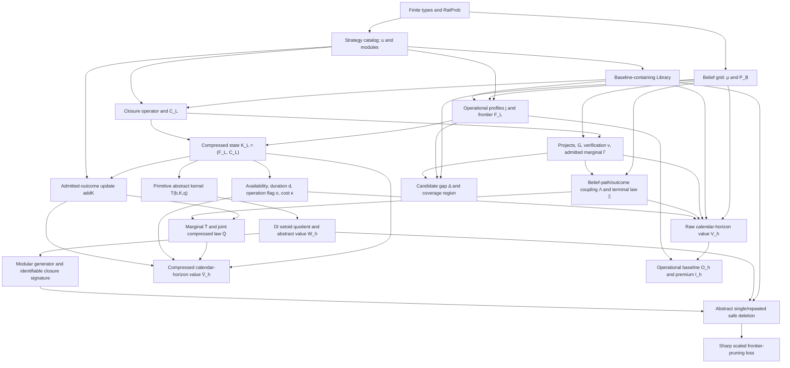
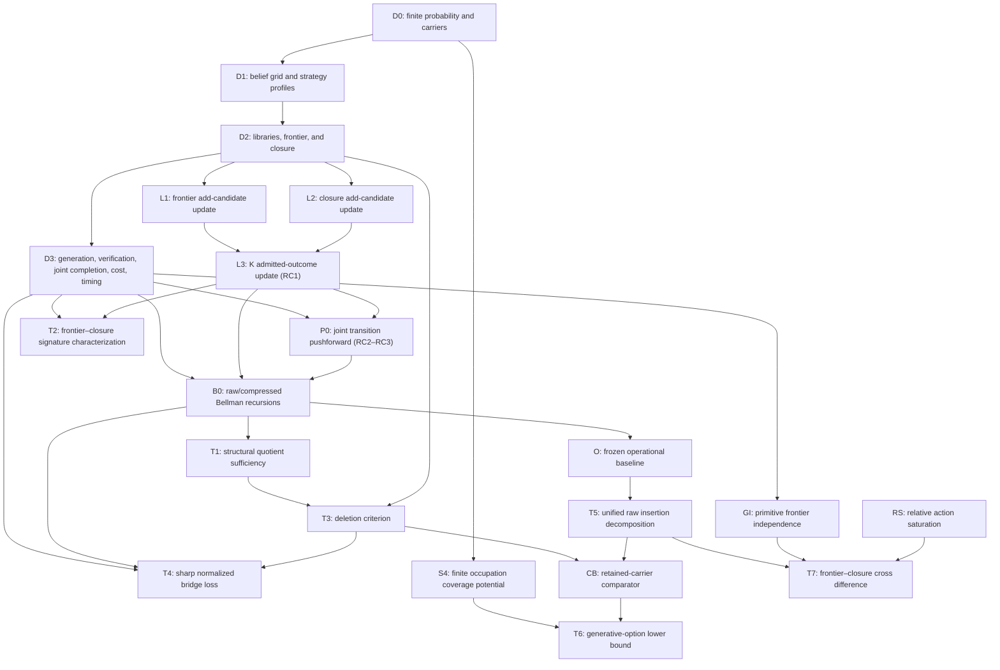

# Formalization Map

## Current state

T1--T7, unified dynamic innovation equivalence (UDI), F0, and the supporting
F1--F8 Lean layers, together with supporting S4--S7, are implemented and
kernel checked.
`FiniteModel` packages the nonempty finite belief, strategy, module, and
research-project carriers. `StrategyCatalog`, `Library`, `ModuleClosure`,
`operationalFrontier`, `rawModuleUnion`, `generativeClosure`, and
`compressedLibraryState` implement the abstract finite-library calculus.
Foundational monotonicity, projection, dominated-insertion, and
redundant-deletion lemmas compile without prohibited placeholders.

`UNIFIED_TIMING_SPEC.md` and `RAW_TO_COMPRESSED_SPEC.md` fix the T1
semantics. The R0 raw layer implements exact
closure-indexed candidate-generation distributions, bounded exact admission
probabilities, the derived normalized admitted-outcome marginal, raw library
updates, local `addCompressedState`, closure absorption, and RC1. A separate,
not-necessarily-product coupling in
`Projection/RawToCompressed.lean` fixes the joint belief-path/outcome law.
The module derives the normalized compressed pushforward, representative
invariance, embedded controlled semi-Markov law, finite calendar-horizon value
factorization, stationary Bellman intertwining, contraction-conditional
fixed-point equality, and optimal-selector lift.

`Quotient/UnifiedDynamicInnovation.lean` now provides the canonical
publication-facing equivalence on raw libraries. It compares current
frontiers and availability-tagged project costs, durations, joint terminal
belief/compressed-state laws, and exact expected operating-reward blocks. Its
equivalence laws, finite raw value preservation, contraction fixed-point
preservation, finite quotient/factorization, compressed-state sufficiency, and
restricted representation refinement are kernel checked.

`Quotient/RawFrontierClosure.lean` proves T2 from the raw model and T1 rather
than the deprecated primitive transition table. It exposes candidate,
admission, admitted-law, and projected-transition factorization; states raw
closure detectability on realizable compressed states; proves both
frontier--closure and compressed-state iff criteria for UDI; and supplies
exact raw-identifier and behaviorally invisible-closure counterexamples.

`Value/SystemInteraction.lean` proves T7 on four realizable compressed states
of the T1 process. It defines the exact closure increment and cross difference,
transports feasible actions across frontiers under primitive independence, and
uses relative action saturation plus finite maximizer selection to obtain the
substitution sign. Its primitive common-gap certificate now derives relative
saturation when every poor action has zero exposure to a single antitone
descendant gap, rich exposures are nonnegative, and fixed continuation
preserves the shared action-value decomposition. Exact strict-substitution,
frontier-dependent complementarity, separable, primitive-independent
project-switching, and Continue-pair examples delimit the result.

`Interaction/PrimitiveSubstitution.lean` supplies the transition-level
specialization of the T7 primitive corollary. It defines the descendant-gap
recursion under the process's fixed belief kernel, proves its frontier order
by finite-horizon induction, constructs the existing common-gap certificate,
derives relative action saturation, and applies unchanged T7. Exact namespace
theorems retain the project-switching and frontier-dependent-success
complementarity boundaries and the separable zero case.

`Compression/UnifiedSafeDeletion.lean` proves T3 from the raw compressed
state, T1, UDI, and T2. It defines operational and generative redundancy under
one raw deletion, proves their conjunction equivalent to compressed-state
preservation, derives finite/infinite value and stationary action-order
preservation, and proves the detectable observation-level converse. Its
proof-relevant trace rechecks both predicates at every intermediate library,
and `PruningAlgorithmSpec` requires every pruning output to carry such a
trace. `UnifiedSafeDeletionExamples.lean` supplies the four exact deletion
classes and the stale-certificate/order boundary.

`SAFE_COMPRESSION_THEOREM_SPEC.md` and
`SAFE_COMPRESSION_PROOF_OUTLINE.md` now assemble these productive dependencies
with the finite additive resource layer. The composite SC target proves
safe-domain nonemptiness and minimum attainment, the detectable
frontier--closure/UDI biconditional, preservation of finite and stationary
values and stationary action correspondences, the one-way minimum-to-
irreducible implication, the exact nonglobal pruning boundary, and the
equal-active-weight cardinality corollary. The human proof is complete.
OPT-FND and OPT-T2T4 now provide the resource structure, finite argmin,
detectability-guarded feasibility equivalence, productive preservation,
minimum-to-one-deletion implication, rechecked-endpoint theorem, and two exact
local/global counterexamples as separate axiom-audited Lean declarations. The
equal-active-weight cardinality corollary, the generic inclusion-wise bridge,
and one monolithic SC declaration remain open.

`COMPLEXITY_AUDIT.md` and
`SAFE_COMPRESSION_COMPLEXITY_APPENDIX_PROOF.md` add the proposed SC-COMP
layer. Identity closure turns exact safety into weighted hitting set on
frontier-attainer and module-carrier hyperedges. Explicit weight-preserving
reductions show that frontier-only, closure-only, and combined decision
problems are NP-complete, while the optimizers are NP-hard. The exact Julia
constructors and exhaustive small fixture are implemented. No Lean
complexity language, reduction theorem, SC-COMP declaration, or axiom audit
exists, so the active manuscript remains unchanged.

`RatProb` implements exact finitely supported rational mass functions with
nonnegativity and total-mass proofs. The older `FiniteResearchSemantics`
supplies a primitive belief kernel and primitive compressed-state research
kernel. Its top-level `DynamicInnovationEquivalent` and quotient results are
deprecated as a final-model interface and retained only for F1--F4.
`ModularGenerator` exposes frontier--closure factorization, and
`ClosureIdentifiable` requires distinct realizable closures at a common
frontier to be separated by some belief--project transition. Under those exact
assumptions, DI equivalence is characterized by equality of the frontier and
closure.

`SafeDeletion.lean` defines equality-after-deletion redundancy, compressed
state preservation, value-safe deletion, deletion observation preservation,
proof-relevant sequential deletion, and innovation-safe sublibraries. Under
factorization, frontier and closure preservation imply DI and value
preservation. Under closure identifiability, current rewards plus every
project-transition law recover frontier and closure. A typed zero-discount
counterexample rules out the value-only converse.

`FrontierPruningLoss.lean` adds an explicit singleton-belief/project/module
construction with three strategies. Frontier-only pruning removes a
zero-payoff, uniquely generative bridge. At horizon two and discount one half,
loss is exactly half the future reward; reward scaling gives arbitrary natural
targets and a reward cap `C` gives the sharp maximum `C / 2`.

`Value/FiniteHorizon.lean` adds a separate genuine finite-state Bellman
calculus with exact rational belief and compressed-state transitions,
nonnegative project costs, rational discount, finite project delays, action
maximization, monotonicity, cost-sensitive DI preservation, boundedness,
compressed-state factorization, and optimal-action existence. Its transition
kernel is primitive and its action timing follows A-FH-VALUE, so it is
supporting F5 rather than the accepted raw/compressed Bellman bridge for T1.

`Value/Decomposition.lean` defines passive and full library values, the
research-option premium, and total, operational, and generative innovation of
one strategy insertion. The exact F6 accounting identity is unconditional.
Frontier--closure zero-total sufficiency uses explicit cost/transition
factorization, while premium monotonicity uses exact stochastic transition
monotonicity and antitone costs. A reused bridge construction has operational
innovation zero and generative innovation exactly one.

`Value/UnifiedDecomposition.lean` rebuilds these insertion objects on the T1
raw process. Passive value freezes the raw library; full value is T1
`rawValue`; and companion compressed definitions are identified by T1. It
proves the exact T5 insertion identity, both silence consequences,
fixed-candidate operational antitonicity, and premium monotonicity under an
explicit certificate comparing the complete unified project-action values.
Its exact bridge derives the admitted outcome law from raw generation and
primitive admission and supplies a valid T1 completion coupling.

`Value/GenerativeLowerBound.lean` proves T6 on that same raw process. It
defines the exact committed-project value, completion-continuation gain,
operating/passive-baseline adjustment, full path expectation, and terminal
occupation weights. It now also pushes the existing joint completion law to
the terminal distinguished-descendant mass and proves the primary T6 bound
under a frontier-silent project-enabling carrier, zero-premium deleted
comparator, fitting duration, and a nonnegative pathwise complete-continuation
floor \(G\), without independence. The earlier raw generation mass
\(\rho^d\), primitive admission \(\pi\), and process-wide T1
conditional-independence predicate factor that joint term only in a corollary.
It proves pointwise joint-mass and gain monotonicity, cost antitonicity,
operating-adjustment monotonicity, the occupation/product forms, zero and
strict-positive conditions, and exact one-belief raw carrier examples.

`Value/JointDescendantLowerBound.lean` is the dedicated publication-facing T6
interface. It proves every terminal joint descendant component lies in
\([0,1]\), exposes the expected operating and frozen-passive blocks, and
decomposes committed-project value into cost, those exact blocks, joint
descendant gain, and the remaining continuation after other outcomes. It
re-exports the no-independence bound and product corollary under canonical
names, proves mass/gain monotonicity and cost antitonicity, and kernel-checks
one-belief, correlated two-belief, and both-direction duration examples.

`Value/ComparativeStatics.lean` proves the supporting CS1 family. A primitive
`GenerativeDominanceOrder` gives full compressed/raw value monotonicity by
strong calendar-horizon induction. Frontier-independent opportunities
specialize that order to fixed-closure frontier monotonicity. Separate exact
theorems establish passive frontier saturation, dynamic research-cost
antitonicity, binary-law admission and survival monotonicity, corrected
unified elapsed-time delay antitonicity, T5 generative-dominance closure
monotonicity, and finite action-region inclusion. Exact counterexamples reject
every corresponding unconditional sign; CS1 does not prove or replace T7.

`Value/SystemInteraction.lean` formalizes publication-facing T7 on four
realizable compressed states. It defines the closure value increment and
frontier--closure cross difference, packages the ordered state rectangle,
reuses CS1's primitive frontier-independence predicate, and proves
substitution from an explicit relative Bellman-action saturation condition.
`CommonGapActionDecomposition` and `PrimitiveSubstitutionAssumptions` provide
the fixed-continuation, single-descendant primitive subclass and derive the
relative-saturation field before applying general T7. Exact examples give
strict substitution, strict frontier-dependent-success complementarity,
separability, the project-switching counterexample that invalidates the weaker
frontier-independence-only claim, and the Continue-pair boundary that rejects
an added-exposure-order shortcut.

`Interaction/PrimitiveSubstitution.lean` formalizes the recursion-stable
canonical T7 subclass. Pointwise ordered gap flows and terminal gaps are
propagated by the process's shared rational belief kernel and nonnegative
discount. The resulting common-gap action certificate feeds the general
finite-max theorem; no arbitrary optimized-continuation preservation is
claimed.

`Coverage/DiscountSurvivalInteraction.lean` proves supporting result S6. It
specializes finite occupation to powers of an exact rational row-stochastic
matrix, identifies the truncated resolvent applied to a nonnegative gap,
proves monotonicity in discount and survival, and factors their four-corner
cross difference into nonnegative date-specific terms. The infinite inverse
resolvent and any real derivative are deliberately outside the Lean claim.

`Coverage/KernelComparativeStatics.lean` proves supporting result S7. It
defines exact finite discounted state occupation, the positive-gap advantage
region, advantage-region occupation dominance, and the gap-tailored kernel
order. A finite-sum rearrangement proves that advantage-region occupation
dominance implies coverage dominance. The exact symmetric two-state
persistence family is row stochastic, yet increasing its persistence raises,
lowers, or leaves coverage unchanged according to the gap location. Both
universal scalar signs are therefore refuted in Lean.

`Value/InnovationEquation.lean` proves the one-step frontier-gap identity and
the exact finite-horizon equation identifying passive operational innovation
with the discounted expected gap sum along the belief kernel. It also proves a
positive-mass reachable-state zero criterion, diminishing marginal operational
innovation under library inclusion, and a two-belief delayed-benefit example.

`Coverage/Potential.lean` defines a finite ordered belief grid, exact
time-specific occupation weights, certified positive-part candidate gaps,
discounted survival-adjusted occupation, and S4 coverage potential. Exact
finite-sum rearrangement identifies the potential with the declared one-shot
gross operational research value. Pointwise gap/discount/survival/occupation
monotonicity, reachable-support zero value, finite regional/global bounds, a
delayed-benefit witness, and frontier-improvement antitonicity are verified.
This primitive gross representation is not T6's retained-carrier descendant
bound.

`Coverage/SingleGap.lean` defines interval support, weak single-peakedness,
ordered quasi-concavity, and connected upper level sets, proving the expected
finite-order implications. Its S5 monotone-gap upper-threshold theorem uses an
exact row-stochastic kernel with first-order stochastic monotonicity. An
increasing nonnegative gap, increasing nonnegative survival or success factor,
nonnegative discount, and antitone cost give increasing gross coverage and an
empty-or-upper-threshold one-shot cost-covering set. Exact set and cutoff
comparative statics cover cost, survival, admission probability, and a fixed
candidate under frontier improvement. Exact three-state counterexamples rule
out single-peaked preservation under an arbitrary kernel and threshold
geometry under arbitrary cost. No optimal Bellman research region is claimed.

The publication-facing Bellman layer now works directly on the unified T1
raw process and its realizable compressed projection. It proves exact
finite-horizon action attainment, monotonicity, raw and compressed sup-norm
\(\beta\)-contraction, unique fixed points, geometric value-iteration
convergence, raw/compressed and UDI value equality, stationary selector
existence, and the selector's unique policy-evaluation equation. The positive
duration coefficient is \(\beta^{d(q)}\), and the incumbent operation block
uses the joint completion law. The older primitive F5/F8 contraction remains
a compatibility layer rather than the final Bellman theorem.

`Fixtures/Generated.lean` is produced together with eighteen versioned JSON
records from one exact Julia fixture catalog. Its transparent finite-list
evaluators recompute frontiers, module availability, decomposition values,
discounted gap sums, coverage potentials, research regions, and component
counts over `ℚ`. The checked examples establish implementation agreement on
those finite records only; they add no general theorem and do not replace the
named proof modules above. `Fixtures/UnifiedBellman.lean` and the paired
`FX-S2-UNIFIED-STATIONARY-01` Julia witness separately instantiate the unified
positive-duration selector and exact policy-evaluation equation.
`Fixtures/UnifiedCanonical.lean` then checks the publication-facing
raw-derived six-state fixture: normalized primitive and pushforward laws,
positive-duration \(P^d\) timing, raw/compressed finite values, the exact
stationary table and selector, lifted raw policy evaluation, zero residual,
and strict action separation.

The operational profile remains an exact rational table \(j:S\to B\to
\mathbb Q\). The hidden-state carrier, belief interpretation, and proof that
\(j_s(b)=\sum_x\mu_b(x)u_s(x)\) remain lower-level adapters. R0 covers raw
generation and verification interfaces, the derived admitted marginal, and
local raw/compressed updates. T1 adds displayed cost, availability,
duration/operation data, the joint belief-path coupling, transition
pushforwards, the realizable-state subtype, and the raw/compressed Bellman
  recursions. T2 adds the exact raw frontier--closure characterization, T3
  adds unified single and rechecked stepwise safe deletion, and T4 adds the
  exact raw survival/admission bridge-loss construction, T5 adds the raw
  passive/full insertion decomposition and dominance results, and T6 adds the
  cost-adjusted retained-carrier descendant bound. T7 adds the corrected
  realizable-state frontier--closure interaction theorem. The hidden-state
  expectation adapter remains absent.

The reusable Julia package now mirrors the frozen finite F0/F1/F3 compression
core and the primitive F5/F8 discounted dynamic program. It has
domain-separated belief, strategy, module, and project identifiers; exact
`RatProb`; exact-by-default and explicitly selected Float64 profiles and belief
kernels; validated strategy catalogs and inactive-containing raw libraries; an
exhaustively axiom-checked finite module closure; frontier, raw module union,
generative closure, compressed state, deletion redundancy, frontier-only and
stepwise innovation-safe pruning, exhaustive small-instance minimum
compression, a solver-neutral exact 0--1 formulation, and an exact decision
procedure for primitive F1 dynamic innovation equivalence. Its finite state is
the belief--compressed-library product; exact rational Bellman recursion,
cost-sensitive dynamic-equivalence checks, delays, exact stationary policy
iteration, and sparse Float64 value iteration mirror the F5/F8 operators and
timing. Canonical rational matrix I/O is lossless. Exact tests reproduce the F4
loss through the reusable Bellman operator. The coverage API also evaluates
the exact S7 persistence response surface and reports both gap-weighted
coverage and positive-gap occupation. The Julia layer still does not construct
a quotient or implement the richer raw T1 transition model.

The version-2 prospective controlled suite now composes these interfaces into seven
mechanism experiments. Exact A--F fixtures test raw-alias invariance,
frontier/closure channel separation, stepwise safe deletion, scaled F4 loss,
F6 value decomposition, S5/C2 coverage boundaries, and an S4 fixed-candidate
ranking construction with an independent date-first evaluator, bounded-score
separation check, and marginal set selection. Seeded Float64 family G maps the
primitive F5/F8 continue/research policy over cost, delay, persistence, and
discount changes. This is computational composition of the supporting layers,
not a missing raw-model adapter, a universal ranking theorem, a reinterpretation
of the adverse ETF holdout, or a new formal result.

The revision falsification script supplies a separate exact
`Rational{BigInt}` oracle for the positive-duration unified semi-Markov
calendar recursion. It derives admission from generation and verification,
accepts non-product terminal belief/admission couplings, compares raw and
compressed transitions and values, and searches T1--T7 plus the declared
comparative-static boundaries. Its admission and RC1 portions now have R0 Lean
counterparts, but its joint coupling, transition, timing, and value types are
still script-local regression evidence rather than reusable Lean/package types.

The accepted core uses a finite belief grid, exact rational distributions,
finite strategy and module catalogs, set-valued libraries, a module closure
operator, and finite-horizon value. Continuous beliefs and infinite-horizon
raw-model fixed points are extension layers; F8 verifies only the primitive
finite-state infinite-horizon value extension.

`RESOURCE_MODEL_SPEC.md` and D-0111 fix a conservative resource interface:
active catalog strategies have positive rational weights, the inactive row
has weight zero, \(W(L)\) is additive, and capacity or price applies only to
the one-time outer retention decision. `ResourceOptimization.jl` implements
the exact finite outer algebra and enumeration. Lean now implements burden,
source-relative safe compression, rational capacity foundations, the exact
T2--T4 safe-optimization core, two local/global counterexamples, the generic
fixed-finite-family CAP value and breakpoint core, and its exact
joint-capability shape counterexample. The productive process remains
unchanged.

`OPTIMIZATION_PROBLEM_SPEC.md` and D-0112 freeze the safe, capacity,
penalized, and conditional replacement domains. Julia implements their finite
outer-library core. Lean implements the source-relative safe domain, rational
capacity predicate, and generic fixed-finite-family capacity and penalty
optimizers, but not their typed eligible-catalog adapters or the replacement
optimizer. The T2 biconditional uses
`RawClosureDetectable`, and the exact unsupported-capacity witness remains
separate from any positive constrained--penalized comparison.

`LOCAL_VS_GLOBAL_COMPRESSION_SPEC.md`, D-0113, and D-0126 further freeze the role of
T3 deletion inside \(P_{\mathrm{safe}}\): a certified active deletion is a
strict feasible reduction, a trace is feasible only through stepwise
rechecking, and terminal irreducibility requires an explicit completeness
condition. The minimized weighted catalogs now pass exact Julia search and
refute both the local-to-global converse and a strict-heaviest-first rule.
Lean now verifies rechecked endpoint feasibility, global-minimum-to-one-
deletion irreducibility, the unit endpoint boundary, and the exact
strict-heaviest-first boundary.

`OPTIMIZATION_THEOREM_REVISIONS.md` is the gate for proposed T2 and T4--T9.
It records 13 failed shortcuts, the surviving penalized-burden order, and the
only statements eligible for later Lean work.

`PENALIZED_ENVELOPE_SPEC.md`, D-0117, and D-0127 now provide PEN,
the planned optimization T6. The exact rational branches are embedded in a
canonical real-price envelope. The specification proves finite value,
continuity, nonincrease, convexity, piecewise affinity, finite active
breakpoints, unique-optimizer derivatives, extreme-burden one-sided slopes,
and the all-optimizer-pairs burden order. The requested finite core is Lean
verified through a direct finite candidate-price characterization; active-face
one-sided formulas and the raw boundary remain human/Julia-only.

BRIDGE_ELASTICITY_SPEC.md and D-0120 isolate supporting BEM from the broader
planned T8. They define the named real-coordinate extension of the exact T4
scalar margin, its normalized positive margin and amplification factor, the
zero-cost and duration-exposure formulas, and action-region reporting at or
below zero. The exact boundary is \(M_{\mathrm{br}}/A_{\mathrm{br}}\downarrow
0\), not unqualified \(M_{\mathrm{br}}\downarrow0\). Lean now verifies the
five named-coordinate margin and positive-loss derivatives, all displayed
elasticities, the normalized-margin right-limit blow-up, its costless
vanishing-gross boundary, and an exact finite example. No reusable Julia
implementation exists.

CHANNEL_ELASTICITY_SPEC.md and D-0122 supply proposed CED, the human
channel-elasticity decomposition for planned T8. CED places the Lean-verified
T5 level identity on one named positive real path, differentiates it, and
defines total-normalized operational and generative contributions. The convex
weighted-average formula is restricted to strictly positive channel levels;
zero and negative levels use contributions directly, with no positive-share
interpretation inferred. Lean now verifies the neighborhood-path
derivative identity, signed scaled and normalized contributions, the
positive-level weighted average, and all three exact examples. A concrete T5
path adapter and reusable Julia implementation remain absent.

INNOVATION_DURATION_SPEC.md and D-0121 replace the underspecified broad T9
with proposed IDCV. The theorem scalarizes one fixed component of the S6
finite exposure sum, embeds its exact rational coefficients in a positive-real
effective-discount domain, and defines normalized timing weights, their mean
date, and their variance. It proves the log-elasticity, log-curvature, bounds,
equality cases, and exact rational examples at the human level. The existing
S6 finite-sum theorem remains Lean verified. The real finite-sum layer now
verifies polynomial and quotient derivatives, duration as point elasticity,
scaled duration derivative as timing variance, variance nonnegativity, and
four exact examples. Separate log-composition calculus, support equality
cases, duration bounds, and a reusable Julia implementation remain absent.

The former general set-valued switching target is excluded from the current
formalization roadmap under D-0139. The internal archived switching-elasticity
note, omitted from the public release export, is future work rather than a
planned Lean layer.
PEN's finite envelope and candidate-price declarations, together with exact
optimizer margins, globally active benchmark breakpoints, and Bellman action
gaps, remain in their existing verified or computed roles.

CAPACITY_ELASTICITY_SPEC.md and D-0124 supply proposed supporting CPEL for
planned T6--T7. CPEL keeps CAP's discrete capacity step and PEN's set-valued
optimal-burden correspondence, adds positive-base forward arc normalization,
and proves zero-cell, jump-sum, capacity-spike, nonpositive demand, and
unequal-burden tie-boundary formulas at the human level. CAP and PEN now
provide verified finite parent cores plus exact Julia fixtures, but no CPEL
Lean declaration, axiom audit, or reusable Julia reporting routine exists.

## Planned physical layers

| Layer | Mathematical content | Planned Lean area | Planned Julia area | Current status |
|---|---|---|---|---|
| discrete resource-elasticity adapters | guarded forward capacity arcs, strict-jump decomposition and spike formula, optimal-burden correspondence, nonpositive price-demand arcs, and unequal-burden tie boundary | planned `StrategyInnovation/Resource/CapacityElasticity.lean` | not assigned | proposed CPEL has a complete human deduction and direct exact rational examples; CAP/PEN finite parent cores are Lean verified, while CPEL's jump-sum/normalization layer and a reusable Julia report API are absent |
| channel-elasticity real extension | common positive real path through T5 total, operational, and generative insertion values; derivative identity, total-normalized contributions, and positive-channel weighted average | `StrategyInnovation/Value/ChannelElasticity.lean` | not assigned | real neighborhood accounting, derivative additivity, signed contribution decomposition, positive-level weighted average, and three exact examples Lean verified; model-specific T5 path adapter and Julia implementation absent |
| finite probability | `RatProb`, finite sums, product kernels | `StrategyInnovation/Basic/Probability.lean` | `src/Types.jl` | Lean and reusable Julia exact finite-support `RatProb`, expectation, and Dirac mass implemented; product kernels pending |
| finite model carriers | hidden state, belief, strategy, module, project types | `StrategyInnovation/Basic/Model.lean` | `src/Types.jl` | Lean carriers and Julia domain-separated belief/strategy/module/project IDs implemented; hidden-state carrier pending |
| belief grid | \(\mu_b\), \(P_B\), operational expectation | `StrategyInnovation/Basic/BeliefGrid.lean` | `src/Beliefs.jl` | Julia finite belief labels and exact/explicit-Float64 row-stochastic kernels implemented; interpretations absent |
| strategy catalog | payoff and module tables, \(j_s\) | `StrategyInnovation/Library/Strategy.lean` | `src/Profiles.jl` | Lean and Julia exact profile/module interfaces and validated inactive zero row implemented; hidden-payoff adapter pending |
| retention resources | immutable \(w_s\), additive \(W(L)\), rational \(B\), outer capacity feasibility, exact safe compression, and generic finite penalized/capacity envelopes | `StrategyInnovation/Optimization/{ResourceBurden,SafeCompression,Capacity,PenalizedEnvelope,CapacityValue}.lean` | `src/ResourceOptimization.jl` | Lean foundational algebra, safe optimization, capacity feasibility, and requested finite PEN/CAP cores verified; exact Julia optimizers, breakpoints, fixtures, and tests retained |
| penalized affine envelope | fixed finite family, real-price affine branches, finite candidate switches, local affine slopes, and burden order | `StrategyInnovation/Optimization/PenalizedEnvelope.lean` | `src/ResourceOptimization.jl` | finite maximum, continuity, convexity, nonincrease, optimizer existence, finite candidate characterization, strict-dominance/outside-candidate and outside-actual-breakpoint slopes, and antitone selected burden Lean verified; active-face one-sided formulas and raw boundary remain open |
| finite hard-capacity value | fixed finite family, zero-burden inactive library, real-capacity maximum, attainable burdens, constant cells, finite breakpoints, and exact shadows | `StrategyInnovation/Optimization/{CapacityValue,CapacityCounterexample,CapacityDiminishingReturns}.lean` | `src/ResourceOptimization.jl` | CAP finite maximum, monotonicity, half-open consecutive-burden constancy, breakpoint containment/finiteness, shadow nonnegativity, the joint-capability increasing-return witness, and the separate sorted additive-unit grid condition Lean verified; typed eligible-catalog adapter, global partition packaging, jump-sum identity, and submodular witness remain open |
| safe-compression complexity | identity-cover obligations, weighted-set-cover reductions, representation-aware general closure | planned `StrategyInnovation/Resource/Complexity.lean` | `src/SafeCompressionComplexity.jl`, `scripts/verify_safe_compression_complexity_reductions.jl` | complete human proof and exact exhaustive small-instance fixture; Lean complexity layer absent |
| innovation-duration real extension | fixed scalar S6 exposure, positive real effective discount, normalized timing weights, mean date, and timing variance | `StrategyInnovation/Coverage/InnovationDuration.lean` | not assigned | finite polynomial/quotient derivatives, duration and variance identities, nonnegativity, and four exact evaluations Lean verified; separate log composition, support equality cases/bounds, and Julia implementation absent |
| library | inactive-containing finite sets, insertion, deletion | `StrategyInnovation/Library/Library.lean` | `src/Libraries.jl` | Lean structure and Julia validated set-valued raw library, insertion, and noninactive deletion implemented |
| closure | finite closure axioms, \(U_L\), \(C_L\) | `StrategyInnovation/Library/Closure.lean` | `src/Libraries.jl` | Lean closure calculus and Julia exhaustive extensivity/monotonicity/idempotence validation, union, and closure implemented |
| frontier | upper-envelope value \(F_L\) | `StrategyInnovation/Library/Frontier.lean` | `src/Profiles.jl`, `src/Libraries.jl` | Lean lemmas and Julia attained exact/Float64 pointwise maximum implemented and property tested |
| generation | \(G,\nu,\Gamma,\Lambda,\Xi,\kappa\), duration, operation flag, and availability | `StrategyInnovation/Raw/{CandidateGeneration,Admission,AdmittedCandidate}.lean`, `StrategyInnovation/Projection/RawToCompressed.lean` | `src/RawDynamicProgramming.jl` | R0 generation/admission and normalized marginal plus T1's declared joint coupling, cost, availability, and unified timing are implemented in Lean and reusable exact Julia; constructor validation checks both completion marginals |
| compressed state | \(K_L\), realizable image, admitted-outcome update `addK` | `StrategyInnovation/Library/InnovationState.lean`, `StrategyInnovation/Raw/{LibraryUpdate,CompressedUpdate}.lean`, `StrategyInnovation/Projection/RawToCompressed.lean` | `src/Libraries.jl`, `src/RawDynamicProgramming.jl` | ambient pair, raw/local update, RC1, finite realizable carrier, and exact transition pushforwards are implemented and cross-checked |
| unified DI quotient | five cost-sensitive raw-model observations, finite quotient, finite/infinite value preservation, compressed-state sufficiency | `StrategyInnovation/Quotient/UnifiedDynamicInnovation.lean` | `src/RawDynamicProgramming.jl` | UDI is Lean verified; reusable Julia compares the five effective observations and tests equal finite/stationary values and policies for equivalent raw libraries |
| raw frontier--closure characterization | raw generator/admission factorization, T1 projection, closure detectability, UDI iff \(K\), exact counterexamples | `StrategyInnovation/Quotient/RawFrontierClosure.lean` | `src/RawDynamicProgramming.jl`, exact script oracle | T2 is Lean verified; Julia exposes the raw-derived compressed observation law while the raw-identifier and invisible-closure boundaries remain kernel checked |
| deprecated abstract DI quotient | primitive compressed kernel, behavioral equivalence, finite quotient | `StrategyInnovation/Quotient/DynamicInnovation.lean` | `src/Libraries.jl` for the relation | F1 verified but superseded as a final-model interface; retained for F1--F4 compatibility |
| abstract frontier--closure characterization | modular factorization, project separation, iff, counterexamples | `StrategyInnovation/Quotient/FrontierClosure.lean` | not assigned | F2 forward/converse/iff and exact finite counterexamples verified |
| finite Bellman value | legacy generic finite-state calculus plus unified raw and compressed calendar-horizon recursions | `StrategyInnovation/Value/FiniteHorizon.lean`, `StrategyInnovation/Projection/RawToCompressed.lean` | `src/RawDynamicProgramming.jl`; deprecated compatibility in `src/DynamicProgramming.jl` | T1's unified raw/compressed recursion is the reusable Julia source of truth and is checked at every fixture horizon; F5's old timing remains only as a warning-emitting compatibility API |
| discounted Bellman contraction and stationary policy | unified real sup-norm raw/compressed operators, fixed points, convergence, selector, policy evaluation, and exact canonical instance | `StrategyInnovation/Bellman/Unified.lean`, `StrategyInnovation/Fixtures/UnifiedCanonical.lean`, with `Bellman/Contraction.lean` retained for F8 compatibility | `src/RawDynamicProgramming.jl`, `scripts/{search_revision_counterexamples,solve_unified_canonical_benchmark}.jl` | S2 is Lean verified; the raw-derived six-state fixture kernel-checks its laws, registered finite values, stationary table, lifted selector, zero residual, and unique actions; exact Julia raw/compressed policy iteration agrees statewise, while the older primitive solver remains deprecated |
| compression results | supporting F3 plus unified T1--T4 | `StrategyInnovation/Compression/{SafeDeletion,UnifiedSafeDeletion,UnifiedSafeDeletionExamples,NormalizedPruningLoss}.lean`, `StrategyInnovation/Projection/RawToCompressed.lean`, `StrategyInnovation/Quotient/RawFrontierClosure.lean` | `src/Libraries.jl`, `src/Compression.jl` | raw T3 deletion safety and T4 exact normalized bridge loss verified; no greedy approximation-ratio or minimum-cardinality theorem |
| pruning counterexample | primary normalized T4 plus supporting scaled F4 | `StrategyInnovation/Compression/NormalizedPruningLoss.lean`, `StrategyInnovation/Counterexamples/FrontierPruningLoss.lean` | `src/Compression.jl`, `scripts/run_compression_experiments.jl` | T4 proves exact `β^d ρ^d π C - κ`, cap sharpness, ratio one, unit normalization, and operation adjustment; F4/Julia retain the deterministic scaled specialization |
| value decomposition and comparative statics | unified raw passive/full insertion values and T5; joint descendant-event T6 lower bound and exact commitment accounting; CS1 one-way finite orders; T7 frontier--closure cross difference; recursion-stable primitive common-gap sufficient condition; supporting F6 accounting and F7 primitive-adapter passive gap equation | `StrategyInnovation/Value/{UnifiedDecomposition,GenerativeLowerBound,JointDescendantLowerBound,ComparativeStatics,SystemInteraction,Decomposition,InnovationEquation}.lean`, `StrategyInnovation/Interaction/PrimitiveSubstitution.lean` | `src/InnovationValue.jl`, `scripts/{search_revision_counterexamples,search_joint_descendant_bound,run_system_interaction_surface,search_primitive_substitution}.jl` | T5--T7 and CS1 verified on the unified model; T6's dedicated interface proves joint mass in the unit interval, exact cost/operating/joint/remaining commitment accounting, the no-independence bound, factorization corollary, comparative statics, and no unconditional duration sign; F6/F7 remain verified supporting interfaces, but no named Lean bridge identifies F7's passive recursion with unified T5; general T7 retains relative action saturation, while the fixed-kernel common-gap subclass derives the gap order by finite-horizon induction and then derives saturation from nonnegative rich exposure and zero poor exposure; optimizer switching remains an exact boundary |
| coverage | S4 occupation potential; S5 finite monotone region; S6 discount--survival complementarity; S7 gap-aligned kernel comparison; C2 disconnected multi-gap boundary | `StrategyInnovation/Coverage/{Potential,DiscountSurvivalInteraction,KernelComparativeStatics,SingleGap}.lean`, `StrategyInnovation/Counterexamples/MultiGapRegion.lean` | `src/Coverage.jl`, `scripts/{run_coverage_geometry,run_kernel_persistence_response}.jl` | reusable exact/Float64 coverage computations and S4/S5/S6/S7/C2 fixtures pass; S6/S7 are finite and use no derivative or universal persistence sign |
| bridge-margin elasticity extension | fixed-\(d\) named real-coordinate extension of T4; normalized margin, amplification factor, boundary limits, action-region classification, and exact rational finite changes | `StrategyInnovation/Compression/BridgeMarginElasticity.lean` | not assigned | five real derivatives, positive-loss transfer, elasticities, normalized-margin blow-up/boundary, and exact example Lean verified; reusable Julia implementation absent |
| proof audit | imports, axiom reports, placeholder scan, active-correspondence coverage | `StrategyInnovation/Audit/` | not applicable | release linter passes; 752 distinct axiom commands cover all 276 distinct active correspondence names plus audited dependencies, the exact canonical fixture, optimization/elasticity extensions, and compatibility declarations; details in `PREPRINT_LEAN_AUDIT.md` |

Unimplemented paths remain plans and do not authorize work out of dependency
order.

## Reusable Julia core correspondence

| Frozen Lean object or declaration | Julia API | Validation status |
|---|---|---|
| `FiniteModel.Belief`, `StrategyId`, `ModuleId`, `ResearchProject` | `Belief`, `StrategyId`, `ModuleId`, `ResearchProjectId` / `ResearchProject` | nonempty carriers, unique IDs, and reference resolution tested |
| `RatProb`, `probability`, `expectation`, `dirac` | `RatProb`, `probability`, `expectation`, `dirac` | arbitrary-precision exact normalization and extensional equality tested |
| `StrategyCatalog` and inactive certificates | `StrategyCatalog`, `OperationalProfile`, `Strategy`, `GenerativeModule` | zero profile, empty modules, unique IDs, and belief/module references checked at construction |
| `Library`, `Library.insert`, `Library.erase` | `RawLibrary`, `insert_strategy`, `delete_strategy` | set semantics, inactive membership, and resolved references tested |
| `ModuleClosure` | `GenerativeClosure`, `module_closure` | all finite subsets exhaustively checked for extensivity, monotonicity, and idempotence |
| `operationalFrontier` | `operational_frontier` / `frontier` | membership bound, zero bound, attainment, upper-bound iff, monotonicity, and dominated insertion property tested |
| `rawModuleUnion`, `generativeClosure` | `raw_module_union` / `module_union`, `generative_closure` | membership, extensivity, monotonicity, and redundant-deletion property tested |
| `InnovationState`, `compressedLibraryState` | `CompressedLibraryState` / `InnovationState`, `compressed_library_state` / `compressed_state` | exact component projections and deletion-state equivalence tested |
| R0 candidate generation, admission, and admitted law | `candidate_generation_distribution`, `admission_probability`, `admitted_candidate_distribution` | exact generation laws are catalog-validated; partial verification is tested to move rejected mass into failure exactly |
| R0 raw and compressed updates; T1 induced law | `raw_library_update`, `compressed_state_update`, `induced_compressed_transition` | exhaustive fixture libraries and outcomes satisfy RC1; raw pushforwards equal compressed laws |
| T1 completion coupling and unified timing | `ProjectCompletionOutcome`, `UnifiedResearchProject`, `RawInnovationProcess`, `raw_embedded_transition`, `compressed_embedded_transition` | positive duration, active/suspended operation, initiation cost, Markov-path marginal, admitted-law marginal, and correlated completion are exact and validated |
| T1 finite Bellman values | `raw_finite_horizon_value`, `compressed_finite_horizon_value`, corresponding policy functions | raw/compressed values and selected actions agree at every tested library, belief, and horizon |
| S2 stationary Bellman operators and selectors | `raw_bellman_operator`, `compressed_bellman_operator`, `raw_infinite_horizon_policy_iteration`, `compressed_infinite_horizon_policy_iteration` | exact raw/compressed fixed-point values and policies agree; Lean bridge fixture values are 2 and 4 with both residuals zero |
| F3 `operationallyRedundant`, `generativelyRedundant` | `operationally_redundant`, `generatively_redundant` | all admissible fixture libraries and noninactive deletions exhaustively checked |
| F3 compressed-state-preserving deletion | `innovation_safe_delete`, `innovation_safe_prune_fixed_point` | every step checks frontier and closure against its intermediate library; exact batch counterexample and seeded finite properties tested |
| F3 component/DI/value audit | `verify_compressed_equivalence` | frontier, closure, compressed state, optional primitive F1 DI, and optional model-specific value checks reported separately |
| minimum compressed-state representative | `minimum_safe_compression`, `minimum_safe_compression_ip_formulation` | exhaustive cardinality minimum checked against safe fixed point; 0--1 constraints exhaustively matched compressed-state equality on small identity and nonidentity closures; no Lean optimization theorem |
| F4 `frontierOnlyPrune` and scaled loss | `frontier_only_prune`, `exact_frontier_loss_fixture` | exact targets 0, 1, 5, and 13 reproduce current-frontier preservation, closure loss, and horizon-two loss `reward / 2` |
| `FiniteResearchSemantics`, `DynamicInnovationEquivalent` | deprecated `FiniteResearchSemantics`, `dynamic_innovation_equivalent` compatibility method | exact primitive transitions plus reflexivity, symmetry, and transitivity remain tested; construction emits a migration warning |
| F5 `Process`, `Action`, `continueValue`, `researchValue` | deprecated `DiscountedResearchProcess`, plus its legacy operators | exact compatibility construction remains tested, but emits a warning because its primitive transition and `β^(delay+1)` timing are not the raw source of truth |
| F5 `bellmanStep`, `finiteHorizonValue`, optimizer existence | `bellman_step`, `finite_horizon_value`, `finite_horizon_policy`, `extract_policy` | exact hand calculations, the Lean F4/arbitrary-loss family, monotonicity, deterministic candidates, failures, and 32 seeded small-process properties pass |
| F5 cost-sensitive `DynamicInnovationEquivalent` | `dynamic_innovation_equivalent(::DiscountedResearchProcess, ...)` | exact-only frontier/cost/candidate-law decision procedure; DI state pairs receive equal finite- and infinite-horizon values in tests |
| F8 Bellman contraction, iteration, and geometric estimate | `value_iteration`, `bellman_residual`, `contraction_error_bound`, `residual_error_bound` | sparse Float64 contraction and β-close-to-one tests pass; canonical output records every increment, residual, and error bound |
| finite stationary computational solvers | unified raw/compressed policy iteration; deprecated `exact_policy_iteration` compatibility solver | reusable raw-derived rational policy evaluation agrees across representations; the positive-duration Lean S2 fixture has exact policy and Bellman residuals zero |
| exact artifact scalar/matrix encoding | `encode_exact_rational`, `write_exact_matrix`, `read_exact_matrix` | deterministic lossless round trip tested |
| `Coverage.FiniteOrderedBeliefGrid` | `OrderedBeliefGrid` | nonempty finite carrier inherited from `FiniteBeliefSpace`; one finite, strictly increasing coordinate per belief validated |
| `Coverage.certifiedGap`, C2 aggregate `projectGap` | `candidate_gap`, `project_gap` | exact positive-part and two-candidate endpoint-gap fixtures reproduce the Lean tables |
| `Coverage.discountedOccupationWeight`, `coveragePotential` | `finite_discounted_occupation`, `finite_coverage_potential`, `coverage_potential` | exact S4 horizon-two occupation and potential match Lean; 30 seeded rational kernels satisfy finite-sum/solve monotonicity checks |
| S5 `expectedGap`, `grossCoverageValue`, `oneShotCostCoveringSet` | `gross_coverage_value`, `cost_covering_set` (`research_region` compatibility wrapper) | exact positive theorem class, cutoff directions, and both destructive-kernel/arbitrary-cost boundary fixtures tested |
| S5 finite order hypotheses and conclusion | `is_stochastically_monotone`, `is_monotone_sequence`, `is_antitone_sequence`, `extract_threshold` | finite upper-tail FOSD diagnostic, sequence hypotheses, and empty/full/upper/lower/not-threshold classifications tested |
| S6 truncated matrix resolvent and finite cross difference | `finite_discounted_occupation`, `finite_coverage_potential`, `finite_discount_survival_interaction` | exact `Rational{BigInt}` finite-sum identity, factorized four-corner difference, and monotone discount effects validated |
| C2 disconnected strict region | `connected_components`, `component_count`, `project_gap` | exact potential `(4,41/32,1/2,41/32,4)`, two-component strict region, and three-component arbitrary-cost fixture match Lean |
| computational infinite occupation/sensitivity extension | `discounted_occupation_matrix`, `discounted_gap_solve`, `infinite_coverage_potential`, `delayed_lifetime_coverage_potential`, `boundary_transversality`, `coverage_sensitivity` | exact rational resolvents for small models, Float64 geometry for 121 states, grid-refinement tests, and six declared sensitivity axes; not Lean theorems |
| exact fixture consistency bridge | `julia/scripts/export_exact_fixtures.jl`, `shared/schemas/exact_fixture.schema.json`, `Fixtures/Generated.lean` | seven `Rational{BigInt}`/`ℚ` models render deterministically; Julia byte-comparison/validation tests and kernel-checked Lean examples pass; fixture agreement only |

This table records computational correspondence and tests, not Lean proof. The
`FiniteResearchSemantics` Julia relation mirrors F1's primitive cost-free
semantics; the `DiscountedResearchProcess` overload mirrors F5's cost-sensitive
relation. Neither may be cited as raw T1 dynamic equivalence.

## Definition dependency graph

## Theorem dependency graph

T2 does not depend on generic MDP-minimization results. It is a raw UDI
characterization under A-T2-OBS, derived through T1. T4 derives exact
survival/admission mass and a fixed-parameter sharp cap before retaining
arbitrary loss only as an explicit reward-scaling corollary.

F1 is an independent supporting branch from the ambient compressed state to a
primitive compressed transition kernel and its behavioral quotient. It does
not bypass `D3`, local update, or `B0` on the path to T1.

F2--F4 extend that same abstract branch with frontier--closure factorization,
identifiability, deletion, and a scaled pruning-loss construction. They do not
bypass the raw-model prerequisites on the paths to T2--T4.

F2 extends that abstract branch with a declared modular generator and an
economically interpretable project-separation condition. It does not bypass
the raw cost/admission signature required for T2.

## Topological implementation order

1. finite carriers, `RatProb`, finite expectation, coupling, marginal, and
   pushforward lemmas;
2. belief-grid interpretation and transition kernel;
3. strategy catalog and operational profiles;
4. baseline-containing libraries and admission;
5. closure operator, raw module union, and closure algebra;
6. pointwise frontier and finite-maximum lemmas;
7. raw generation, verification composition, derived admitted law, and its
   normalization;
8. compressed state and realizable-image finiteness;
9. closure absorption plus frontier, closure, and admitted-outcome update RC1;
10. belief-path/outcome coupling, terminal joint law, marginal and joint
    compressed pushforwards, and embedded controlled-Markov RC2--RC3;
11. availability, duration, operation flag, initiation cost, and unified raw
    and compressed calendar-horizon Bellman recursions;
12. finite T1/RC4 by strong induction on calendar horizon;
13. T2 using raw-process closure detectability and the T1 projection;
14. T3 using compressed-state component equality, T1 value/action projection,
    T2 detectability for the converse, and rechecked deletion traces;
15. raw survival/admission bridge law, cost-sensitive exact T4 formula, cap,
    ratio, and operation adjustment;
16. unified raw passive/full insertion values, T5 algebra, silence,
    operational antitonicity, project dominance, and bridge witness;
17. supporting S4 finite occupation potential, then single-candidate gap
    identity and T6;
18. positive-duration fixed-point factorization, axiom reports, and
    line-by-line theorem-ledger reconciliation.

No higher-level theorem should be attempted before the numbered prerequisites
compile.

Steps 1--18 are now implemented at the exact finite raw interface, apart from
the lower-level hidden-state expectation adapter in step 2. T1 supplies the
joint-coupling algebra, realizable compressed carrier, transition pushforwards,
and unified raw/compressed Bellman definitions; T2--T6 build on those
interfaces, and T7 supplies the corrected system-interaction theorem.
Supporting F1--F8 and S4--S7/C2 remain separate compiled branches.
Product-kernel algebra remains an optional independence specialization used
only by T6's product corollary, not its primary joint-law theorem and not a
general T1 assumption.

For Julia Phase 6, this run completes the reusable exact finite-support
distribution, finite belief-kernel, profile/catalog, raw-library,
frontier/closure, compressed-state, single-deletion redundancy, guarded
stepwise pruning, exhaustive small-instance minimum compression, exact 0--1
formulation, and primitive dynamic-innovation-relation core. Float64 is used
only by the synthetic scaling experiment. The script-local F1 recursion is an
audit oracle, not a reusable Bellman implementation. This run does not migrate
the Phase 2 raw bitmask oracle, implement generation/verification/admission,
build `addK`, or implement accepted raw/compressed Bellman value functions.
It also completes the version-1 exact fixture interchange and regeneration
gate. The generated evaluator deliberately remains a small transparent
finite-list model rather than an adapter proving equivalence to every richer
Lean raw-model structure.

## Implemented foundational declarations

| Role | Lean declaration |
|---|---|
| profile membership bound | `operationalProfile_le_frontier` |
| inactive zero bound | `zero_le_operationalFrontier` |
| finite maximum attainment | `exists_profile_eq_operationalFrontier` |
| frontier upper-bound characterization | `operationalFrontier_le_iff` |
| frontier monotonicity | `operationalFrontier_mono` |
| dominated insertion preserves frontier | `operationalFrontier_insert_of_operationallyRedundant` |
| module-union membership | `mem_rawModuleUnion` |
| module-union monotonicity | `rawModuleUnion_mono` |
| raw union lies in closure | `rawModuleUnion_subset_generativeClosure` |
| closure monotonicity | `generativeClosure_mono` |
| redundant deletion preserves closure | `generativeClosure_erase_of_generativelyRedundant` |
| compressed equality projects to frontier | `operationalFrontier_eq_of_compressedLibraryState_eq` |
| compressed equality projects to closure | `generativeClosure_eq_of_compressedLibraryState_eq` |
| derived admitted law is nonnegative | `Raw.admittedCandidateDistribution_nonnegative` |
| derived admitted law is normalized | `Raw.admittedCandidateDistribution_totalMass` |
| failed raw admission is a no-op | `Raw.rawLibraryUpdate_none` |
| successful raw admission inserts | `Raw.rawLibraryUpdate_some` |
| closure absorbs a closed base | `Raw.closure_absorption` |
| inserted raw module union update | `Raw.rawModuleUnion_insert` |
| inserted generative closure update | `Raw.generativeClosure_insert` |
| inserted frontier pointwise maximum | `Raw.operationalFrontier_insert` |
| compressed raw-update identity RC1 | `Raw.compressedLibraryState_rawLibraryUpdate` |
| DI equivalence reflexivity | `dynamicInnovationEquivalent_refl` |
| DI equivalence symmetry | `dynamicInnovationEquivalent_symm` |
| DI equivalence transitivity | `dynamicInnovationEquivalent_trans` |
| compressed abstract value congruence | `compressedFiniteHorizonValue_eq_of_frontier_and_transition_eq` |
| DI finite-horizon value preservation | `finiteHorizonValue_eq_of_dynamicInnovationEquivalent` |
| quotient-value evaluation | `quotientFiniteHorizonValue_mk` |
| abstract Markov sufficiency | `finiteHorizonValue_depends_only_on_dynamicInnovationClass` |
| explicit representation refinement | `representation_refines_dynamicInnovationEquivalent` |
| canonical quotient refinement map | `representationQuotientToDynamicInnovationQuotient_mk` |
| generator factorization on raw libraries | `researchTransition_eq_modularGenerator_on_library` |
| frontier/closure sufficiency for DI | `frontierClosure_eq_implies_dynamicInnovationEquivalent` |
| identifiable converse | `dynamicInnovationEquivalent_implies_frontierClosure_eq` |
| frontier--closure characterization | `dynamicInnovationEquivalent_iff_frontierClosure_eq` |
| compressed-state characterization | `dynamicInnovationEquivalent_iff_compressedLibraryState_eq` |
| frontier/closure value sufficiency | `frontierClosure_eq_preserves_finiteHorizonValue` |
| missing-reward counterexample | `frontier_converse_fails_without_currentReward` |
| missing-closure-identification counterexample | `closure_converse_fails_without_identifiability` |
| deletion components iff compressed-state preservation | `redundantDeletion_iff_compressedStatePreservingDeletion` |
| redundant deletion gives DI | `redundantDeletion_dynamicInnovationEquivalent` |
| redundant deletion gives finite-horizon safety | `redundantDeletion_safelyDeletable` |
| identifiable deletion-observation converse | `deletionObservations_imply_operationallyAndGenerativelyRedundant` |
| exact deletion-observation characterization | `deletionPreservesCurrentRewardAndProjects_iff_redundant` |
| repeated safe deletion preserves value | `safeDeletionSequence_preserves_finiteHorizonValue` |
| repeated safe deletion gives safe compression | `safeDeletionSequence_innovationSafeCompression` |
| value-only deletion converse counterexample | `finiteHorizonValuePreservation_does_not_imply_generativeRedundancy` |
| unified T3 deletion components iff compressed state | `Projection.Model.redundantDeletion_iff_compressedLibraryState_eq` |
| unified T3 innovation-safety certificate | `Projection.Model.redundantDeletion_innovationSafe` |
| unified T3 fixed-point value preservation | `Projection.Model.DiscountedContractionModel.redundantDeletion_preserves_infiniteHorizonValue` |
| unified T3 action-order preservation | `Projection.Model.DiscountedContractionModel.redundantDeletion_preserves_actionValueComparison` |
| unified T3 detectable converse | `Projection.Model.innovationSafeDeletion_iff_redundant` |
| rechecked deletion endpoint equivalence | `Projection.Model.RedundantDeletionSequence.dynamicInnovationEquivalent` |
| certified pruning makes every step safe | `Projection.Model.PruningAlgorithmSpec.everyDeletion_safe` |
| stale-certificates exact counterexample | `Projection.Model.UnifiedSafeDeletionExamples.staleOriginalRedundancyChecks_doNotCompose` |
| T4 raw canonical construction certificate | `Projection.Model.NormalizedPruningLoss.canonicalConstruction_certificate` |
| T4 exact normalized loss | `Projection.Model.NormalizedPruningLoss.canonicalPruningLoss_exact` |
| T4 sharp cap | `Projection.Model.NormalizedPruningLoss.rewardCap_sharp` |
| T4 full attainable-value destruction | `Projection.Model.NormalizedPruningLoss.destroys_all_attainable_descendant_value` |
| T4 unit normalization | `Projection.Model.NormalizedPruningLoss.unitRewardCap_loss_le_one` |
| T4 scaling-only corollary | `Projection.Model.NormalizedPruningLoss.arbitraryLoss_by_rewardScaling` |
| T4 continued-operation formula | `Projection.Model.NormalizedPruningLoss.canonicalPruningLossWithOperation_exact` |
| unique bridge module | `keyModule_unique_to_dominated` |
| frontier-only rule deletes bridge | `frontierOnlyPrune_eq_pruned` |
| exact two-period pruning loss | `frontierPruningLoss_exact` |
| exact scaled target loss | `frontierPruningLoss_scaledTarget_exact` |
| arbitrary scaled pruning loss | `frontierPruningLoss_arbitrarilyLarge` |
| sharp capped-reward loss | `boundedReward_frontierPruningLoss_sharp` |
| exact expectation extensionality | `FiniteHorizon.expectedValue_extensionality` |
| exact expectation monotonicity | `FiniteHorizon.expectedValue_mono` |
| finite Bellman monotonicity | `FiniteHorizon.bellmanStep_mono` |
| cost-sensitive DI value preservation | `FiniteHorizon.finiteHorizonValue_eq_of_dynamicInnovationEquivalent` |
| uniform finite-horizon boundedness | `FiniteHorizon.finiteHorizonValue_bounded` |
| compressed-state value factorization | `FiniteHorizon.finiteHorizonValue_factors_through_compressedState` |
| finite optimal action existence | `FiniteHorizon.finiteHorizon_optimalAction_exists` |
| exact innovation decomposition | `ValueDecomposition.totalInnovation_eq_operational_add_generative` |
| frontier-preserving operational zero | `ValueDecomposition.operationalInnovation_eq_zero_of_frontier_eq` |
| frontier/closure-preserving total zero | `ValueDecomposition.totalInnovation_eq_zero_of_frontier_closure_eq` |
| stochastic premium monotonicity | `ValueDecomposition.moduleInsertion_does_not_reduce_researchOptionPremium` |
| positive generative exact example | `ValueDecomposition.ExactExample.operationalInnovation_zero_generativeInnovation_positive` |
| one-step frontier-gap identity | `InnovationEquation.operationalFrontier_insert_sub_eq_frontierGap` |
| supporting primitive-adapter passive gap-sum identity | `InnovationEquation.passiveOperationalInnovation_eq_discountedGapSum` |
| reachable-state zero criterion | `InnovationEquation.passiveOperationalInnovation_eq_zero_of_gap_eq_zero_on_reachable` |
| diminishing marginal operational value | `InnovationEquation.passiveOperationalInnovation_antitone_of_library_inclusion` |
| delayed operational benefit example | `InnovationEquation.DelayedBenefitExample.zero_currentGap_positive_passiveOperationalInnovation` |
| finite coverage-potential representation | `Coverage.coveragePotential_eq_oneShotGrossOperationalResearchValue` |
| coverage monotonicity in gap | `Coverage.coveragePotential_mono_gap` |
| coverage monotonicity in discount | `Coverage.coveragePotential_mono_discount` |
| coverage monotonicity in survival | `Coverage.coveragePotential_mono_survival` |
| coverage monotonicity in occupation | `Coverage.coveragePotential_mono_occupation` |
| reachable-support coverage zero | `Coverage.coveragePotential_eq_zero_of_gap_eq_zero_on_reachable` |
| advantage-region minimum coverage lower bound | `Coverage.advantageRegion_minimumGap_mul_occupation_le_coveragePotential` |
| advantage-region maximum coverage upper bound | `Coverage.coveragePotential_le_maximumGap_mul_advantageRegionOccupation` |
| positive delayed coverage example | `Coverage.DelayedCoverageExample.zero_currentGap_positive_coveragePotential` |
| fixed-candidate frontier antitonicity | `Coverage.OneShotModel.coveragePotential_antitone_of_frontier_improves` |
| quasi-concavity iff connected upper levels | `Coverage.quasiConcaveSequence_iff_connectedUpperLevelSets` |
| single-peaked gap implies quasi-concavity | `Coverage.IsSinglePeaked.quasiConcaveSequence` |
| monotone-gap one-shot upper threshold | `Coverage.monotoneGap_upperThreshold` |
| one-shot cost-covering comparative statics | `Coverage.oneShotCostCoveringSet_antitone_cost`, `Coverage.oneShotCostCoveringSet_mono_survival`, `Coverage.oneShotCostCoveringSet_mono_admissionProbability`, `Coverage.oneShotCostCoveringSet_antitone_frontier` |
| finite cutoff comparative statics | `Coverage.cost_cutoff_mono`, `Coverage.survival_cutoff_antitone`, `Coverage.admissionProbability_cutoff_antitone`, `Coverage.frontier_cutoff_mono` |
| nonmonotone kernel defeats the upper-threshold result with an increasing gap | `Coverage.SingleGapCounterexamples.nonmonotoneKernel_disconnectedCostCoveringSet` |
| kernel destroys single-peaked coverage | `Coverage.SingleGapCounterexamples.singlePeakedGap_disconnectedPotential` |
| non-antitone cost disconnects a monotone covering set | `Coverage.SingleGapCounterexamples.nonAntitoneCost_disconnectedCostCoveringSet` |

The listed coverage declarations are supporting families; T7 is implemented
separately in `Value/SystemInteraction.lean`.

## Resource layer

The foundational resource layer is implemented after the existing library
carrier and before every weighted optimizer theorem. `Optimization/ResourceBurden.lean`
provides catalog-indexed rational weights, the inactive-zero and active-positive
certificates, and the finite sum `libraryBurden`. The outer optimization layer
quantifies over inactive-containing finite libraries and calls the existing
productive value without changing its Bellman operator.
`OPTIMIZATION_PROBLEM_SPEC.md` freezes
source-relative safe compression, full outer-certified-catalog capacity and
penalty selection, and conditional outer-certified-candidate replacement. No
implementation may treat mere raw generation as conferring eligibility.

| Planned object or result | Exact target | Current status |
|---|---|---|
| additive burden | \(W(L)=\sum_{s\in L}w_s\), \(w_{s_0}=0\), active \(w_s>0\) | Lean verified in `Optimization/ResourceBurden.lean`; exact Julia implementation retained |
| resource algebra | nonnegativity, inclusion monotonicity, and strict decrease after deleting a represented active strategy | Lean verified and axiom-audited; exact Julia implementation and fixtures retained |
| outer-certified eligible domain | finite \(S_\theta^{\mathrm{elig}}\subseteq S\) containing \(s_0\); outer certification is distinct from raw stochastic verification | exact Julia carrier is interpreted as eligible; typed certification representation absent |
| safe retained domain | finite \(L'\subseteq L\) containing \(s_0\), with exact \(F_{L'}=F_L\) and general-closure \(C_{L'}=C_L\) | general source-relative wrapper and finite-family proof Lean verified in `Optimization/SafeCompression.lean`; exact Julia specialization retained |
| safe deletion certificate | current-library membership plus exact frontier and closure equality after one active deletion | general compressed-state certificate and component-preservation theorem Lean verified |
| feasible reduction | certified deletion from a source-safe library remains source-safe and strictly lowers burden by \(w_s>0\) | Lean verified and axiom-audited; exact Julia traces and fixtures retained |
| terminal irreducibility | no safe active one-deletion is `OneDeletionIrreducible`; a complete trace has this property, and under monotonicity it equals inclusion-wise minimality | Lean defines and uses the one-deletion predicate; the generic completeness/inclusion-wise bridge remains open |
| local/global separation | an irreducible safe endpoint can have greater burden than another source-safe library; even unique-heaviest-safe-first can fail | both exact boundaries Lean verified; minimized Julia fixtures retained |
| DI-form equivalence | safe and DI feasible sets coincide under T1/UDI sufficiency plus `RawClosureDetectable` for the converse | Lean biconditional verified in `Optimization/SafeCompression.lean` |
| minimum-resource safe optimizer | finite nonempty feasible set and attainment of minimum \(W\) | Lean existence theorem verified without uniqueness; exact Julia enumeration retained |
| optimum local property | every `MinimumWeightSafeCompression` is `OneDeletionIrreducible` | Lean verified; converse refuted by exact unit-weight Lean fixture |
| feasible rechecked endpoint | every `RedundantDeletionSequence` endpoint is source-relative `SafeCompressionFeasible` | Lean verified; no optimality conclusion |
| productive preservation | every safe-feasible library preserves unified finite-horizon value and, under contraction, stationary value and the full optimal-action set | Lean verified; detectability is not required in the forward direction |
| identity-cover characterization | positive-frontier attainer hyperedges plus source-module carrier hyperedges exactly characterize safe feasibility | exact Julia constructor and exhaustive small tests; Lean absent |
| safe-compression complexity | frontier-only, closure-only, and combined identity-closure decision problems are NP-complete; optimization is NP-hard | complete human polynomial reductions and Julia fixture; no Lean complexity encoding or axiom audit |
| general-closure complexity boundary | identity-containing classes inherit NP-hardness; NP membership requires polynomial closure equality | human proof complete; representation-specific Lean target absent |
| rational capacity foundation | nonnegative exact \(B\), \(W(L)\le B\), inactive-only feasibility, budget monotonicity, and sublibrary feasibility | Lean verified in `Optimization/Capacity.lean`; generic real-capacity argmax/step core now follows in `CapacityValue.lean` |
| hard-capacity value | maximize productive \(V_\theta(b,L')\) over a fixed finite family subject to \(W(L')\le B\) | requested generic CAP core Lean verified and axiom-audited; exact Julia eligible-catalog enumeration retained; typed eligible-catalog adapter and stronger partition/jump-sum packaging remain open |
| penalized retention | maximize \(J_{\theta,\lambda}=V_\theta-\lambda W\) over one fixed nonempty finite family | generic real-family Lean representation verified; exact Julia eligible-catalog enumeration, support intervals, and fixtures retained; typed eligible-catalog adapter open |
| PEN finite envelope | canonical real-price extension is finite, continuous, nonincreasing, convex, and locally affine outside a finite pairwise candidate set | Lean verified and axiom-audited; full global cell partition and actual-kink classifier remain open |
| PEN local slopes | strict dominance on an open region gives slope \(-W(L)\); outside either the finite candidate set or the actual non-locally-affine breakpoint set some optimal branch supplies the local slope | Lean verified; active-face one-sided tie slopes and subdifferential remain open |
| PEN burden order and raw boundary | every higher-price optimizer has weakly lower burden than every lower-price optimizer; an antitone selection exists; raw libraries need not be nested | burden order and selection Lean verified; exact nonnested fixture remains Julia boundary evidence |
| conditional replacement | maximize \(V_\theta(b,(L\setminus D)\cup\{c\})\) over active deletions under capacity for outer-certified \(c\notin L\); decompose admission value into unconstrained gain minus least feasible displacement loss | complete supporting REP human proof; exact capacity-release fixture and direct rejection/channel examples; outside raw admission; Lean absent |
| constrained--penalized boundary | penalized optima are capacity-optimal at their own burdens, but unsupported capacity optima and duality gaps may occur | exact realized Julia witness; positive Lean theorem absent |
| resource-aware equivalence | equal productive observations plus equal \(W\) imply equal \(J_\lambda\) | proposed; must not strengthen UDI retroactively |
| nonadditive extension | \(\widetilde W(L)=W(L)+M(L)\) under explicitly stated properties of \(M\) | extension-only |

## Planned key lemmas

| ID | Statement role | Needed by |
|---|---|---|
| L-GAMMA-NORM | the admission law derived from \(G\) and \(\nu\) is normalized (R0 verified) | raw admission |
| L-COUPLING-MARG | \(\Lambda_q\) has belief-path marginal \(\mathbb P_b^{(d_q)}\) and admitted-outcome marginal \(\Gamma\) | joint completion |
| L-FRONT-ADD | \(F_{L\cup\{s\}}(b)=\max(F_L(b),j_s(b))\) (R0 verified) | T1, T3, T6 reuse |
| L-CLOS-ABSORB | \(\operatorname{cl}(\operatorname{cl}(A)\cup D)=\operatorname{cl}(A\cup D)\) (R0 verified) | compressed update |
| L-CLOS-ADD | \(C_{L\cup\{s\}}=\operatorname{cl}(C_L\cup\operatorname{mods}(s))\) (R0 verified) | T1, T3 |
| L-K-ADD | \(K_{L\oplus o}=\operatorname{addK}(K_L,o)\) (RC1/R0 verified) | T1, T2 |
| L-TBAR-PUSH | \(\overline T_q\) is the normalized pushforward of \(\Gamma\) through `addK` | RC2, T1 |
| L-QBAR-PUSH | \(\overline{\mathcal Q}_q\) is the joint terminal pushforward of \(\Xi_q\), with marginals \(P_B^{d_q}\) and \(\overline T_q\) | RC2--RC4, T1 |
| L-FRONT-DELETE | \(F_L=F_{L^{-s}}\) iff \(j_s\le F_{L^{-s}}\) pointwise | optional lower-level characterization beyond verified equality-form T3 |
| L-CLOS-DELETE | \(C_L=C_{L^{-s}}\) iff \(\operatorname{mods}(s)\subseteq C_{L^{-s}}\) | optional lower-level characterization beyond verified equality-form T3 |
| L-T5-PROJECTION | raw full/passive insertion values factor through \(K_L\) where required | T5 |
| L-DESC-GAIN-NONNEG | descendant admission weakly raises Continue-only value under `addK` | T6 |
| L-RELATIVE-SATURATION | every closure-rich action's advantage over every closure-poor action shrinks with the frontier | corrected T7 |
| L-RESOURCE-NONNEG | \(0\le W(L)\) and \(W(\{s_0\})=0\) | resource feasibility |
| L-RESOURCE-INSERT | inserting an absent active strategy raises burden by exactly \(w_s>0\) | weighted deletion and strict comparisons |
| L-SAFEDEL-FEASIBLE | a safe deletion from a source-safe library remains feasible for the source problem | deletion as feasible reduction |
| L-SAFEDEL-STRICT-BURDEN | deleting a certified active strategy lowers \(W\) by exactly \(w_s>0\) | dominance and optimizer irreducibility |
| L-TRACE-SAFE-FEASIBLE | every intermediate library in a rechecked trace belongs to the original safe-feasible family | trace interpretation |
| L-COMPLETE-TRACE-IRREDUCIBLE | endpoint completeness is equivalent to inclusion-wise irreducibility under frontier/closure monotonicity | local endpoint theorem |
| L-GLOBAL-SAFE-IMPLIES-IRREDUCIBLE | every global minimum-weight safe library is inclusion-wise irreducible | one-way local/global comparison |
| L-LOCAL-GLOBAL-WITNESS | an exact searched finite catalog has two safe irreducible endpoints of unequal burden and defeats the declared greedy rule | strict separation; exact Julia fixture ready for Lean encoding |
| L-RESOURCE-MIN-EXISTS | the nonempty finite safe-retained domain attains a minimum of \(W\) | minimum-resource safe optimizer |
| L-NET-EQ-OF-UDI-W | productive UDI plus equal burden gives equal \(J_\lambda\) | resource-aware equivalence |
| L-OPT-FINITE-EXISTS | every nonempty finite safe, capacity, penalty, or replacement domain attains its objective | all four optimizer families |
| L-SAFE-DI-FEASIBLE-EQ | T1/UDI sufficiency and raw closure detectability identify the two safe-feasible families | DI-form safe compression |
| L-IDENTITY-SAFE-HITTING-SET | identity-closure safety iff every positive-frontier attainer and source-module carrier hyperedge is hit | SC-COMP |
| L-SET-COVER-TO-CLOSURE-SAFE | one-belief zero-profile weighted set cover reduces weight-preservingly to closure-only safety | SC-COMP |
| L-SET-COVER-TO-FRONTIER-SAFE | binary-incidence profiles reduce weighted set cover weight-preservingly to frontier-only safety | SC-COMP |
| L-SAFE-COMPRESSION-IN-NP | an active-policy mask permits polynomial exact verification under the explicit input and closure-evaluation assumptions | SC-COMP |
| L-PENALIZED-IMPLIES-CAPACITY | a penalized optimizer is capacity-optimal at its own burden | constrained--penalized comparison |
| L-UNSUPPORTED-CAPACITY-WITNESS | an exact realized finite model has a capacity optimum selected by no nonnegative price | failure of strong Lagrangian equivalence; exact Julia fixture ready |
| L-PEN-FINITE-MAX | a nonempty finite family of finite affine branches has an attained finite maximum | PEN |
| L-PEN-CONTINUOUS-CONVEX | the finite maximum of affine branches is continuous and convex | PEN |
| L-PEN-PIECEWISE-AFFINE | finitely many pairwise intersections partition the nonnegative price axis into affine cells | PEN |
| L-PEN-ACTIVE-FACE-SLOPES | the left/right derivatives are minus the maximum/minimum burdens on the active optimizer face | PEN |
| L-PENALIZED-BURDEN-ANTITONE | if \(\lambda_1<\lambda_2\), every optimizer at \(\lambda_2\) has burden weakly below every optimizer at \(\lambda_1\) | revised penalized-envelope theorem |
| L-PEN-SWITCH-NONNESTED | exact unique optimizers switch between incomparable raw libraries while burden falls | PEN boundary |
| L-CAPACITY-FINITE-EXISTS | the zero-burden inactive library makes every \(B\ge0\) feasible, and the finite family attains its maximum | Lean verified in `CapacityValue.lean` |
| L-CAPACITY-MONO | \(B_1\le B_2\Rightarrow V^\star(B_1)\le V^\star(B_2)\) | Lean verified in `CapacityValue.lean` |
| L-CAPACITY-STEP | consecutive attainable burdens give half-open constant cells | Lean verified directly in `capacityValue_constant_between_attainableBurdens`; globally sorted partition packaging open |
| L-CAPACITY-BREAKPOINTS | every positive non-locally-constant capacity value point is an attainable burden, and the set is finite | Lean verified in `CapacityValue.lean` |
| L-CAPACITY-NONCONCAVE-WITNESS | one lumpy strategy gives exact capacity values \((0,0,1)\) on budgets \(0,1,2\) | concavity boundary |
| L-CAPACITY-COMPLEMENT-WITNESS | two unit-cost carriers of jointly required modules give exact capacity values \((0,0,1)\) | Lean verified in `CapacityCounterexample.lean` |
| L-CAPACITY-SUBMODULAR-WITNESS | a four-policy unit-weight coverage function has cardinality optima \((0,3,4,6,6)\) | submodularity-alone boundary |
| L-CAPACITY-ADDITIVE-UNIT | the sorted-prefix formula induced by additive independent values and equal active weights has nonincreasing discrete capacity marginals | separately Lean verified in `CapacityDiminishingReturns.lean`; no general CAP concavity implication |
| L-REPLACEMENT-BURDEN | \(W((L\setminus D)\cup\{c\})=W(L)+w_c-W(D)\), hence feasibility iff \(W(D)\ge[W(L)+w_c-B]_+\) | REP |
| L-SAFE-INSERT-CONGRUENCE | \(K_{L\setminus D}=K_L\) implies \(K_{(L\setminus D)\cup\{c\}}=K_{L\cup\{c\}}\) | REP safe release |
| L-REPLACEMENT-DECOMPOSITION | \(A_c=G_c-\ell_c^\star\) for the minimum-loss capacity-feasible deletion correspondence | REP |
| L-REPLACEMENT-ZEROLOSS | least displacement loss is zero iff some zero-loss deletion releases the capacity deficit | REP true-trade-off boundary |
| L-REPLACEMENT-SAFETY-BOUNDARY | an exact candidate substitutes the only incumbent module, so no pre-admission safe release exists but candidate-relative safe release does | REP boundary |
| L-REPLACEMENT-REJECT-WITNESS | an exact positive-standalone candidate is rejected because required displacement loss exceeds its incremental gain | REP boundary |
| L-PENALIZED-KINK-WITNESS | one active branch gives \(J^\star(\lambda)=\max\{0,1-\lambda\}\) | set-valued breakpoint and nondifferentiability boundary |

## Theorem target table

| Result | Finite Lean target | Stronger extension | Falsehood risk |
|---|---|---|---|
| T1 | RC1--RC3 and \(V_h^{\mathrm{raw}}(b,L)=\bar V_h(b,K_L)\) on the calendar horizon | positive-duration infinite-horizon factorization | low under the declared joint coupling; false if raw provenance enters it |
| T2 | \(L\sim_{\mathrm{DI}}L'\iff(F_L=F_{L'}\land C_L=C_{L'})\iff K_L=K_{L'}\) under raw A-T2-OBS | full abstraction in a named context class | verified conditional theorem; observability is essential |
| T3 | exact operational-plus-generative equality iff compressed-state preservation; T1 safety consequences; T2-detectable converse | approximation or minimum-cardinality pruning theorem | verified; stale/batch inference is false without rechecking |
| T4 | exact \(\beta^d\rho^d\pi C-\kappa\), sharp cap, ratio one, unit normalization, operation-block adjustment | multi-descendant or repeated-project extension | verified canonical construction; arbitrary loss requires reward scaling |
| T5 | exact raw insertion identity \(\mathcal I_h=\Delta_h^{op}+\Delta_h^{gen}\), silence consequences, operational antitonicity, explicit project-dominance premium order, and bridge witness | less restrictive primitive comparative statics | verified; closure inclusion alone and closure-only separation are false |
| S4 | exact finite survival-adjusted occupation representation and bounds | infinite-horizon resolvent/occupation series | verified finite core; raw-project interpretation remains separate |
| S5 | monotone gap + first-order stochastic monotonicity + increasing survival/success + antitone cost gives a one-shot upper threshold and cutoff directions | arbitrary single-peaked/unimodal preservation or Bellman-region monotonicity | verified finite one-shot theorem; stronger geometry falsified and dynamic interpretation withheld |
| S6 | nonnegative finite Markov gap gives discount--survival complementarity by exact cross difference | infinite inverse-resolvent derivative | verified finite theorem; inverse/derivative interpretation excluded |
| C2 | exact one-project two-gap disconnected strict cost-covering set | variation-diminishing topology bound | verified finite counterexample; kernel-only net-region bound false and narrower potential theorem not formalized |
| T6 | adjusted \(\max\{-\kappa+A^{op}+\beta^d\pi\rho^dE[G],0\}\) descendant-event lower bound, occupation form, signs, comparative statics, exact example | looser multi-descendant bounds | verified; cost/comparator/timing-adjustment omissions are false |
| T7 | \(J_h\le0\) for the frontier--closure value cross difference under primitive frontier independence, menu expansion, and relative Bellman-action saturation | necessity or primitive sufficient conditions for relative saturation | verified corrected theorem; frontier dependence and frontier-independent project switching both create complementarity outside relative saturation |
| SC-COMP | identity-closure safe compression is weighted hitting set; closure-only and frontier-only restrictions are NP-complete by explicit weighted-set-cover reductions | approximation guarantees or broader oracle-closure classes | complete human proof and exact Julia fixture; no Lean complexity layer, so manuscript insertion is gated |
| PEN (planned optimization T6) | finite real-price maximum of exact rational affine branches; continuity, convexity, nonincrease, finite candidate switches, local slopes, and all-optimizer burden order | infinite catalogs, price-dependent feasible families, or raw-inclusion comparative statics | requested finite-envelope form Lean verified; active-face one-sided slopes/global partition and raw boundary remain human/Julia-only |
| CAP (planned optimization T7) | attained finite hard-capacity maximum; monotonicity; half-open attainable-burden cells; finite value-breakpoint containment; exact shadows; joint-capability increasing returns | general concavity, general diminishing returns, or typed eligible-catalog/topological strengthenings | requested finite form and complementarity witness Lean verified; sorted additive-unit grid condition separately verified; stronger partition/jump-sum and submodular boundary remain human/Julia-only |

## Exactness and representation boundaries

- Rational probabilities are structures containing mass, nonnegativity, and
  normalization evidence. `RatProb` uses a `Finsupp`, so its support is finite
  even when the ambient compressed-state carrier is not.
- `InnovationState` is the ambient frontier/closure pair;
  `RealizableInnovationState` will be the finite image subtype of
  `compressedLibraryState`.
- Finite maxima must use the baseline membership proof rather than a default
  rational value. D-0021 makes that baseline the inactive zero strategy.
- Function equality in T2/T3 is extensional equality on finite \(B\).
- Candidate kernels range over the fixed finite catalog. “Creation” means
  admission of a previously absent identifier, not creation of a new Lean
  type inhabitant.
- Resource weights are exact rational catalog data but are not fields of the
  current proof-critical `StrategyCatalog`. The first resource implementation
  may use a separate indexed structure so existing declarations remain
  unchanged.
- The existing \(K_L=(F_L,C_L)\) identifies productive dynamics, not resource
  burden. A net-value optimizer must retain the raw library or use
  \(K_L^W=(F_L,C_L,W(L))\).
- No proof-critical use of floating point or unreviewed `unsafe` is permitted.
- `DynamicInnovationQuotient` is finite because admissible libraries have an
  explicit `Fintype` instance and quotients of finite types are finite.
- The F1 recursion has an explicit idle action but no project-cost term. It
  uses primitive compressed transitions and must not be identified with T1's
  raw or compressed Bellman recursion.
- The F2 iff assumes generator factorization on every ambient compressed state
  and closure identifiability only for pairs realized at a common frontier.
  Its forward and value-sufficiency directions do not use identifiability.
- F3 keeps compressed-state preservation, DI equivalence, and finite-horizon
  value preservation separate. Its converse observes current rewards and
  every project-transition law. Value equality alone does not identify
  closure when continuation is behaviorally irrelevant, as the exact
  zero-discount counterexample shows.
- F4 fixes horizon two and discount one half. Its arbitrary-loss theorem
  explicitly scales the future reward and is now a supporting specialization
  of T4. T4 makes the normalized fixed-parameter formula and sharp cap primary;
  it does not infer arbitrary loss under a fixed cap.
- Target T1 uses a declared joint belief-path/admitted-outcome coupling. The
  admitted marginal \(\Gamma\) and belief marginal \(P_B^{d_q}\) do not imply
  a product law. Its controlled-Markov statement is for embedded decision
  epochs; calendar-time Markovity requires an in-progress-project state when
  \(d_q>1\).
- F5 uses a finite compressed-state carrier and cost-sensitive DI. Continue
  earns the current frontier, research pays cost, and project delay `d`
  discounts completion by `β^(d+1)` while horizon counts decision epochs.
  The primitive kernel and action timing must not be identified with A-TIMING
  or the raw/compressed Bellman bridge required by T1.
- F6's accounting identity is unconditional, but its zero-total theorem uses
  explicit frontier--closure factorization and its premium monotonicity theorem
  uses stochastic dominance, antitone research costs, and unchanged frontier.
  The positive bridge example is existential; no unconditional sign theorem
  for generative innovation is claimed. F6 is not T5's dynamic premium
  recursion.
- T5 replaces F6 as the publication-facing insertion theorem. Its full value
  is T1 `rawValue`; research therefore uses positive calendar duration,
  initiation cost, the correlated path/outcome completion law, raw admission
  update, and the incumbent operation block. Premium monotonicity assumes the
  complete project-action comparison in A-T5-PROJECT-DOMINANCE; closure
  inclusion by itself is insufficient.
- F7 uses the common exact belief kernel and nonnegative discount of the F5/F6
  adapter. Its discounted sum is a finite Markov recursion, and its
  reachability predicate follows nonzero rational mass. It proves the passive
  operational insertion equation only, not T5's optimized premium recursion or
  T6's retained-carrier bound.
- F8 casts the exact F5 data to real value tables on the finite product so the
  sup-norm space is complete. It verifies contraction, the unique value fixed
  point, uniform convergence and its geometric bound, convergence of the cast
  exact horizon recursion, and primitive DI invariance. S2 supersedes it for
  the final model: `Bellman/Unified.lean` derives both raw and compressed
  contractions from T1, keeps finite calendar-horizon feasibility distinct
  from stationary iteration, and proves the optimal selector and its
  policy-evaluation equation.
- S4 uses a separate finite ordered belief grid and primitive exact
  time-specific occupation weights. Its one-shot model normalizes those rows
  and bounds discount and survival in \([0,1]\), while reusable monotonicity
  also permits subprobability/exposure weights. S4 is gross fixed-candidate
  operational value; it does not encode project cost, success/admission, or
  the T6 carrier comparator.
- S5 uses a separate one-transition row-stochastic kernel and the semantic
  finite expectation definition of first-order stochastic monotonicity. Its
  directional increasing-gap and antitone-cost assumptions are essential to
  the verified one-shot upper-threshold conclusion. It does not assert
  log-concavity, TP2, variation diminution, general unimodality preservation,
  any continuous interval result, or monotonicity of an optimal Bellman
  research region.
- S7 compares finite kernel powers only through their discounted occupation
  of positive-gap states. Its sufficient theorem assumes the occupation
  inequalities directly; it neither derives them from a scalar persistence
  order nor claims that diagonal mass has a universal sign. The exact
  two-state family demonstrates both strict directions and equality.
- C2 uses `Fin 5`, one project with two certified candidate gaps, the exact
  degree-four Bernstein/binomial kernel, unit discount and survival, and
  constant strict cost one. It proves a finite disconnected one-shot
  cost-covering set only. The
  exact Julia minor/sign/component audits are not Lean theorems, and no
  `Coverage/TopologyBound.lean` claim exists.

## Extension boundary

The following require new files, assumptions, and theorem-ledger entries:

1. deriving the belief kernel from hidden transition and observation kernels;
2. the full exact probability simplex;
3. batch deletion;
4. provenance-aware libraries;
5. general repeated or multi-gap coverage beyond the exact C2 witness; and
6. continuous or interval-valued belief geometry.

## Kernel-verification audit

Before any research declaration is marked Lean verified:

1. build the pinned project;
2. scan all proof-critical source for `sorry`, `admit`, user axioms, hidden
   placeholders, and unreviewed `unsafe`;
3. run `#print axioms` on the declaration;
4. record the exact output in `THEOREM_LEDGER.md`;
5. reconcile every assumption ID with an exact Lean binder or structure
   field; and
6. confirm that the manuscript states only the finite form actually encoded.
