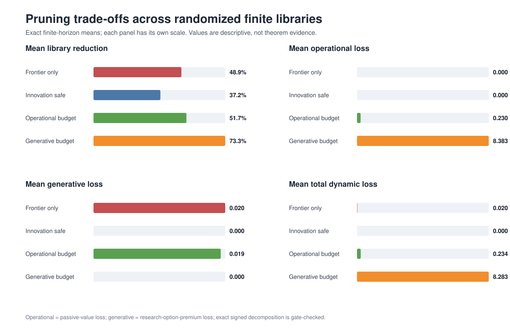
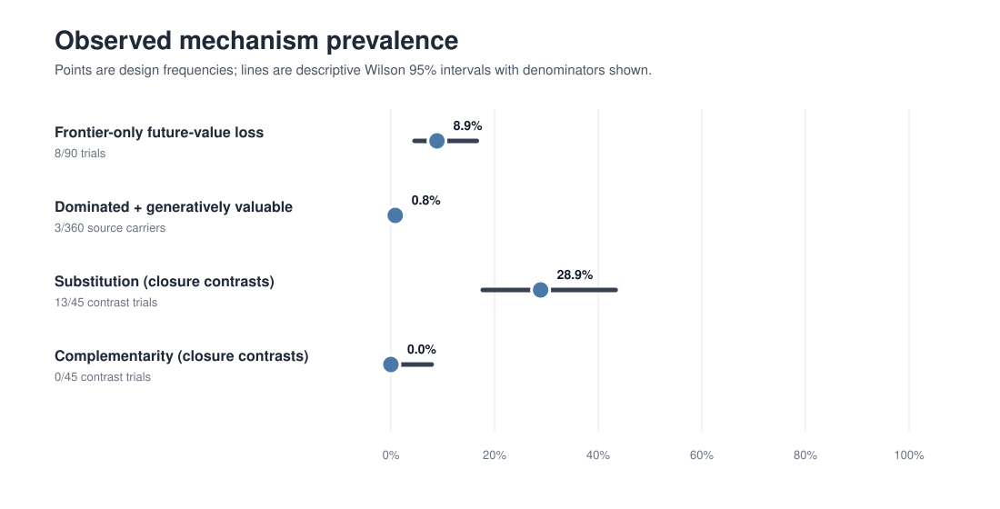
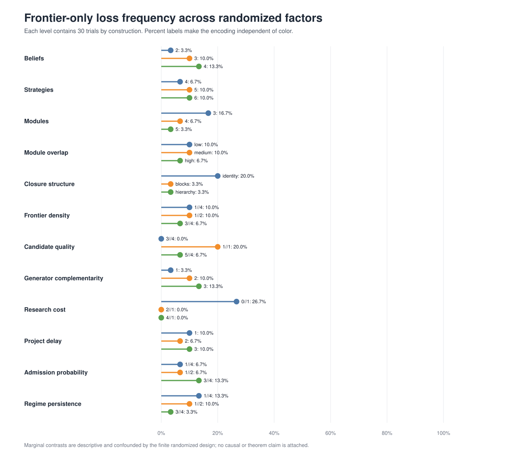

# Randomized finite-library stress test

## Technical summary

Across 90 exact finite-library trials, frontier-only pruning caused positive future-value loss in 8/90 cases (8.9%). Its mean total loss was 0.0201; conditional on a loss, the mean was 0.2261. The observed mechanism is therefore not merely a hand-built possibility in this design, but its frequency remains design-dependent.

Operationally redundant yet generatively valuable carriers appeared in 3/360 source-carrier observations (0.8%; 1.0% conditional on operational redundancy). Among 45 trials with a genuine frontier-only closure contrast, the synthetic frontier–closure rectangle produced 13 substitution and 0 complementarity cases. These are numerical classifications of `J`, not applications of a Lean sign theorem.

> Evidence boundary: every randomized result in this report is an economic-relevance and robustness diagnostic. Random search is not used as proof, theorem validation, or evidence for a universal comparative-static sign.

## Findings with visual evidence

| Pruning rule | Mean reduction | Loss frequency | Mean operational loss | Mean generative loss | Mean total loss | Max total loss |
|---|---:|---:|---:|---:|---:|---:|
| Frontier only | 48.9% | 8/90 (8.9%) | 0.0000 | 0.0201 | 0.0201 | 0.5644 |
| Innovation safe | 37.2% | 0/90 (0.0%) | 0.0000 | 0.0000 | 0.0000 | 0.0000 |
| Operational budget | 51.7% | 31/90 (34.4%) | 0.2304 | 0.0194 | 0.2335 | 1.1623 |
| Generative budget | 73.3% | 82/90 (91.1%) | 8.3829 | 0.0000 | 8.2832 | 10.9375 |

Innovation-safe pruning is the zero-loss reference because every deletion is rechecked for exact frontier and closure preservation. The operational-budget rule controls passive loss only; the generative-budget rule controls research-option-premium loss only. Their unconstrained component can therefore generate a larger total dynamic loss even when the declared budget is met.

The displayed Wilson intervals summarize finite-design sampling variation only. They do not turn the generator into a population model.

The five highest marginal loss-frequency cells were:

- Research cost = `0//1`: 8/30 (26.7%).
- Candidate quality = `1//1`: 6/30 (20.0%).
- Closure structure = `identity`: 6/30 (20.0%).
- Modules = `3`: 5/30 (16.7%).
- Admission probability = `3//4`: 4/30 (13.3%).

These one-factor summaries are descriptive slices of a jointly randomized finite design. They are useful for locating regimes for follow-up analysis, not for causal attribution.

## Scope, data, and definitions

The design independently shuffles balanced three-level columns for belief count, source-library size (including the inactive strategy), module count, module overlap, closure structure, frontier density, candidate quality, generator complementarity, research cost, project delay, admission probability, and regime persistence. Each trial contains two candidate projects. `generator_complementarity = k` means a project requires the joint presence of `k` modules. The raw catalog and raw library remain the source of truth.

Values average uniformly over initial beliefs at horizon 4 with discount factor 3//4. Passive value freezes the library and always continues. Research-option premium is total value minus passive value. For a pruned library:

- operational loss = source passive value − pruned passive value;
- generative loss = source option premium − pruned option premium;
- total dynamic loss = source total value − pruned total value.

The signed identity `total loss = operational loss + generative loss` is checked exactly on every method and one-carrier deletion. Reported loss magnitudes use the positive part; signed fields remain in the source tables.

The four pruning rules are:

1. **Frontier only:** repeatedly deletes current-frontier-redundant strategies and ignores closure.
2. **Innovation safe:** repeatedly deletes only when both the current frontier and closure are preserved.
3. **Approximate operational:** greedily deletes while cumulative passive-value loss relative to the source stays within 1//10 of source passive value.
4. **Approximate generative:** greedily deletes while cumulative option-premium loss relative to the source stays within 1//20 of source option premium.

## Methodology and experimental design

The master seed is `6073180304494120243`; each trial has its own recorded seed and deletion order. Factor columns are exactly marginally balanced. Profiles, module incidence, closure tables, Markov kernels, project requirements, admitted-candidate laws, raw updates, and Bellman recursions are finite. All within-trial arithmetic uses `Rational{BigInt}`; there are no solver tolerances or floating-point Bellman comparisons.

The frontier–closure statistic uses a synthetic compressed-state rectangle: the observed source frontier versus one-half of that frontier, crossed with source closure versus frontier-pruned closure. `J < 0` is labeled substitution, `J > 0` complementarity, and `J = 0` separability. Frequencies are conditioned on a genuine closure contrast. Because the low-frontier states need not be raw-library realizations, this statistic is explicitly a numerical interaction diagnostic.

Exact gates require:

- all loss decompositions to hold as rational equalities;
- frontier-only pruning to preserve passive value;
- innovation-safe pruning to preserve total value;
- each approximate method to satisfy its declared cumulative budget;
- every row to carry `theorem_evidence = false`.

All gates passed in the committed run.

## Source data and reproducibility

Run `julia --project=julia julia/scripts/run_randomized_library_stress.jl` to regenerate, or add `--check` for a nonmutating byte comparison. The configuration SHA-256 is `aa3c04898123b50546dcbf142bd91bbd9da9f926b71ae910e6819b9f5ad31794`.

- [`experiments/results/summaries/randomized_library_trials.csv`](experiments/results/summaries/randomized_library_trials.csv)
- [`experiments/results/summaries/randomized_library_pruning.csv`](experiments/results/summaries/randomized_library_pruning.csv)
- [`experiments/results/summaries/randomized_library_carriers.csv`](experiments/results/summaries/randomized_library_carriers.csv)
- [`experiments/results/summaries/randomized_library_profiles.csv`](experiments/results/summaries/randomized_library_profiles.csv)
- [`experiments/results/summaries/randomized_library_modules.csv`](experiments/results/summaries/randomized_library_modules.csv)
- [`experiments/results/summaries/randomized_library_closures.csv`](experiments/results/summaries/randomized_library_closures.csv)
- [`experiments/results/summaries/randomized_library_kernels.csv`](experiments/results/summaries/randomized_library_kernels.csv)
- [`experiments/results/summaries/randomized_library_projects.csv`](experiments/results/summaries/randomized_library_projects.csv)
- [`experiments/results/summaries/randomized_library_method_summary.csv`](experiments/results/summaries/randomized_library_method_summary.csv)
- [`experiments/results/summaries/randomized_library_factor_summary.csv`](experiments/results/summaries/randomized_library_factor_summary.csv)
- [`experiments/results/summaries/randomized_library_summary.json`](experiments/results/summaries/randomized_library_summary.json)

The trial, profile, module-incidence, closure-table, kernel, and project files are the complete generated source data. The carrier and pruning files contain exact estimands; method and factor summaries plus JSON are derived outputs.

## Limitations and robustness boundaries

- The generator is deliberately broad but not a probability model of real firms, technologies, or research organizations.
- Results cover small libraries, two projects, three-level factor grids, a four-period horizon, and the registered payoff/profile generator.
- Marginal factor cells are balanced but other factors vary jointly; cell differences are not causal effects.
- Wilson intervals quantify design-sampling uncertainty only. They omit model-generator uncertainty and do not support population prevalence claims.
- Exact arithmetic removes numerical error; it does not remove specification error or make randomized evidence deductive.

## Next steps

Use the highest-loss factor cells as preregistered targets for larger-library sparse simulations, then repeat with alternative profile and project generators. Any proposed universal claim must still be formulated and proved independently in Lean; these trials can only motivate or challenge it.

## Further questions

- Does frontier-only loss persist as the candidate count and horizon increase?
- Which closure generators produce complementarity once candidate menus and frontier dependence are expanded?
- Can operational and generative loss budgets be combined into a useful certified bi-criterion pruning rule?
